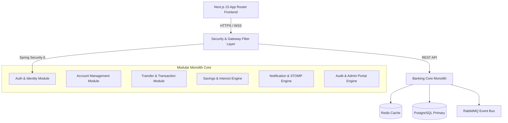
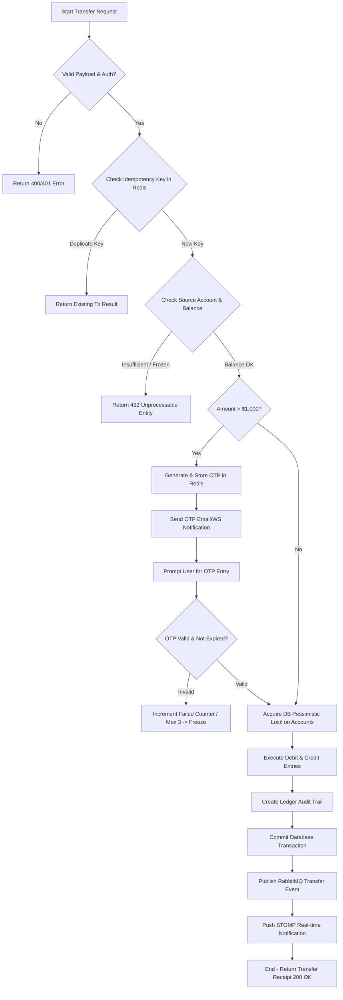

# Business Requirement Document (BRD) - Digital Banking Platform

## 1. Executive Summary

The **Digital Banking Platform** is an enterprise-grade, omnichannel financial solution designed to deliver secure, highly available, and frictionless retail and corporate banking services. Engineered with modern enterprise principles, the platform bridges core banking infrastructure with Next-Gen customer experiences.

### Key Highlights
- **Architecture**: Modular Monolith structured by core domain boundaries to provide high cohesive domain logic, ease of maintenance, and seamless future microservice decomposition.
- **Backend Stack**: Java 21 LTS, Spring Boot 3.3+, Spring Security 6, PostgreSQL 16, Redis 7, RabbitMQ, STOMP WebSockets, and Flyway.
- **Frontend Stack**: Next.js 15 (App Router), React 19, TypeScript, Tailwind CSS, shadcn/ui, TanStack Query v5, Axios, Zod.
- **Core Mission**: Execute high-throughput financial transactions (internal transfers, savings management, bill payments) with sub-second response times, zero data loss, strict ACID guarantees, and auditability adhering to ISO 27001 and OWASP ASVS banking standards.

---

## 2. Project Overview

Modern financial institutions require systems that balance speed of innovation with bulletproof transactional stability. The **Digital Banking Platform** provides a modern digital channel enabling customers to manage accounts, execute transfers, open high-yield savings accounts, track real-time transactions, and manage beneficiaries, while giving bank administrators real-time transaction oversight, user lifecycle control, and risk audit visibility.



---

## 3. Business Objectives

1. **Transaction Reliability & Zero Data Loss**: Guarantee 100% data integrity for financial transactions using strict ACID transaction boundaries, double-entry bookkeeping ledgers, and pessimistic/optimistic locking strategies.
2. **Sub-Second Performance**: Achieve $< 200\text{ms}$ API latency for read operations and $< 500\text{ms}$ for transfer executions under 10,000 peak concurrent active sessions.
3. **Enterprise Security Compliance**: Implement multi-factor authentication (MFA with Email OTP), short-lived HttpOnly JWTs with sliding refresh tokens, dynamic Rate Limiting, and strict RBAC authorization.
4. **Developer Productive Modular Codebase**: Establish clean domain boundaries avoiding premature distributed system complexity, ensuring testability via Testcontainers and 90%+ core domain test coverage.

---

## 4. Functional Requirements

| Requirement ID | Module | Feature | Description | Priority |
|---|---|---|---|---|
| **FR-AUTH-01** | Auth | User Registration | Enable customers to register with email, phone, full name, and national ID. | High |
| **FR-AUTH-02** | Auth | Multi-Factor Login | Secure login returning short-lived JWT + Refresh Cookie + mandatory OTP step for new devices. | High |
| **FR-AUTH-03** | Auth | Password Reset | Self-service password recovery via time-bound email token. | Medium |
| **FR-KYC-01** | Customer | Profile & KYC | Customer identity verification, address submission, and avatar upload. | High |
| **FR-ACC-01** | Account | Multi-Account Core | Support Checking Accounts & High-Yield Savings Accounts with real-time balance tracking. | High |
| **FR-ACC-02** | Account | Account Status Control | Account state transition lifecycle (ACTIVE, FROZEN, DORMANT, CLOSED). | High |
| **FR-BEN-01** | Beneficiary | Beneficiary Book | Add, edit, remove, and tag favorite internal/external beneficiaries with account validation. | Medium |
| **FR-TX-01** | Transfer | Internal Transfer | Real-time transfer between accounts within the bank with daily limits and fee processing. | High |
| **FR-TX-02** | Transfer | OTP Authorization | Secondary step-up authentication using time-based OTP for high-value transactions. | High |
| **FR-TX-03** | Transfer | Double-Entry Audit | Automatic ledger entries for debit and credit sides ensuring strict audit balance. | High |
| **FR-SAV-01** | Savings | Term Deposit | Open term savings deposits with variable interest rates and automated payout schedules. | High |
| **FR-SAV-02** | Savings | Daily Interest Scheduler | Automated nightly cron calculation of accrued interest with maturity alerts. | High |
| **FR-NTF-01** | Notification | Real-time Push | WebSockets STOMP push notifications for deposit credit, transfer debit, and security alerts. | High |
| **FR-ADM-01** | Admin | Risk & Audit Console | Admin monitoring of system logs, user locking, limit configuration, and transaction review. | High |

---

## 5. Non-Functional Requirements

### 5.1 Security
- Password hashing using **BCrypt** (Strength factor 12) or **Argon2id**.
- Session tokens stored in `HttpOnly`, `SameSite=Strict`, `Secure` cookies.
- OWASP Top 10 protection: SQL injection mitigation via JPA parameterized queries, XSS sanitization, CSRF token validation on mutable endpoints, Rate Limiting (100 req/min per IP via Redis Bucket).

### 5.2 Performance & Scalability
- Read operations response time $\le 150\text{ms}$.
- Financial transfer transaction processing time $\le 400\text{ms}$.
- Database Connection Pooling using **HikariCP** with tuned maximum pool size and leak detection.

### 5.3 Availability & Resilience
- 99.95% system uptime target.
- Graceful degradation: Redis cache fallback to PostgreSQL, RabbitMQ retry dead-letter queues (DLQ) for asynchronous events.

### 5.4 Maintainability & Clean Code
- Clean Architecture / Hexagonal principles within Modular Monolith packages.
- Zero cyclic dependencies across domain packages (`auth`, `account`, `transfer`, `savings`, `notification`, `admin`).

---

## 6. User Roles & Access Control

| Role | Code | Privileges & Responsibilities |
|---|---|---|
| **Customer** | `ROLE_CUSTOMER` | Self-registration, profile management, view own accounts, execute transfers, open savings deposits, receive notifications. |
| **Bank Employee** | `ROLE_EMPLOYEE` | Perform customer KYC verification, view account histories, assist customers with account unlock requests. |
| **System Administrator** | `ROLE_ADMIN` | Full access: global user management, system audit logs viewing, transaction fee & daily limit configuration, scheduler manual triggers. |

---

## 7. Business Rules

1. **BR-01 (Account Numbering)**: Every account number must be an 10-digit unique numeric string prefixed by bank identification code (e.g., `8880xxxxxx`).
2. **BR-02 (Sufficient Balance)**: Transfers can only be initiated if `Available Balance = Current Balance - Frozen Amount >= Transfer Amount + Applicable Transaction Fee`.
3. **BR-03 (Daily Transfer Limit)**: Standard customer limit is $10,000 / day. Transfers exceeding $1,000 require mandatory OTP verification.
4. **BR-04 (Idempotent Transactions)**: Every transfer request must supply a client-generated UUID `Idempotency-Key` in HTTP Header to prevent double-spending on retries.
5. **BR-05 (Savings Deposit Rule)**: Early withdrawal of fixed savings accounts before maturity date results in interest penalty (reduced to demand deposit rate 0.1% p.a.).
6. **BR-06 (Account Freeze)**: Accounts subject to 3 failed OTP attempts or flagged for fraud are placed in `FROZEN` status, blocking all outgoing debits.

---

## 8. Business Workflows & Detailed Flows

### 8.1 Internal Transfer Workflow

#### Business Flow
1. Sender initiates transfer specifying Source Account, Beneficiary Account Number, Amount, and Remark.
2. System validates account eligibility, balance sufficiency, daily limits, and idempotency key.
3. If amount $> \$1,000$, system generates an OTP, sends via email/SMS, and holds transaction in `PENDING_OTP` state.
4. User submits valid OTP.
5. System locks both accounts in pessimistic write mode (`SELECT FOR UPDATE` in database), executes debit/credit ledger records, updates account balances, logs audit event, and commits transaction.
6. Real-time STOMP notification sent to both Sender and Receiver.

#### Validation Rules
- Source account status must be `ACTIVE`.
- Receiver account status must be `ACTIVE`.
- Amount must be greater than zero ($> 0.00$).
- Sender must not transfer money to the exact same account.

#### Flowchart (Mermaid)



---

## 9. System Use Case Diagram

```mermaid
usecaseDiagram
    actor Customer
    actor Employee
    actor Admin
    
    rectangle "Digital Banking System" {
        usecase "Login & OTP Authentication" as UC1
        usecase "View Account Dashboard" as UC2
        usecase "Execute Internal Transfer" as UC3
        usecase "Manage Beneficiaries" as UC4
        usecase "Open Term Savings Deposit" as UC5
        usecase "Verify Customer KYC" as UC6
        usecase "Manage User Accounts" as UC7
        usecase "View Global Audit Trail" as UC8
        usecase "Configure System Limits" as UC9
    }
    
    Customer --> UC1
    Customer --> UC2
    Customer --> UC3
    Customer --> UC4
    Customer --> UC5
    
    Employee --> UC1
    Employee --> UC6
    Employee --> UC2
    
    Admin --> UC1
    Admin --> UC7
    Admin --> UC8
    Admin --> UC9
```
