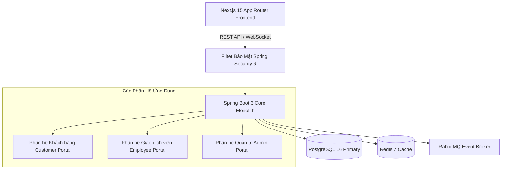

# Tài Liệu Yêu Cầu Nghiệp Vụ (Business Requirement Document - BRD)

## 1. Tóm Tắt Tổng Quan (Executive Summary)

Nền tảng **Digital Banking Platform** là giải pháp ngân hàng số đa kênh (Omnichannel Banking) cấp Doanh nghiệp, được thiết kế để cung cấp các dịch vụ tài chính an toàn, sẵn sàng cao và không rào cản cho cả khách hàng cá nhân và nhân viên quản trị.

### Điểm Nổi Bật Về Kiến Trúc & Công Nghệ
- **Kiến trúc**: Modular Monolith tách biệt theo các Domain nghiệp vụ rõ ràng, dễ bảo trì và sẵn sàng chuyển đổi sang Microservices khi mở rộng quy mô.
- **Backend Stack**: Java 21 LTS, Spring Boot 3.3+, Spring Security 6, PostgreSQL 16, Redis 7, RabbitMQ, STOMP WebSockets.
- **Frontend Stack**: Next.js 15 (App Router), React 19, TypeScript, Tailwind CSS, TanStack Query v5, Lucide Icons.
- **Mục tiêu cốt lõi**: Xử lý giao dịch tài chính tốc độ cao với thời gian phản hồi sub-second (< 200ms), đảm bảo tính toàn vẹn dữ liệu tuyệt đối (ACID) và tuân thủ các quy chuẩn bảo mật ngân hàng OWASP & ISO 27001.

---

## 2. Tổng Quan Dự Án & Phạm Vi Hệ Thống

Hệ thống bao gồm **3 phân hệ độc lập** kết nối thống nhất với hệ thống Core Banking:

---

## 3. Danh Mục Yêu Cầu Chức Năng Chi Tiết (Functional Requirements)

### A. Phân Hệ Khách Hàng (Customer Portal)

| Mã Yêu Cầu | Module | Tên Tính Năng | Mô Tả Nghiệp Vụ Chi Tiết | Mức Độ Ưu Tiên |
|---|---|---|---|---|
| **FR-AUTH-01** | Auth | Đăng ký trực tuyến | Cho phép khách hàng mở tài khoản mới với Email, SĐT, Họ tên và CCCD. | Cao |
| **FR-AUTH-02** | Auth | Đăng nhập đa yếu tố | Xác thực đăng nhập bằng JWT, HttpOnly Cookie và mã OTP cho thiết bị mới. | Cao |
| **FR-DASH-01** | Dashboard | Tổng quan tài khoản | Xem tổng số dư, danh sách tài khoản, biểu đồ dòng tiền thu/chi và lối tắt giao dịch. | Cao |
| **FR-CARD-01** | Cards | Quản lý Thẻ ngân hàng | Danh sách thẻ Debit/Credit/Virtual; **Khóa/mở khóa thẻ khẩn cấp**; **Đổi mã PIN 6 số**; Cấu hình hạn mức Online/ATM/POS. | **Cao (Ưu tiên 1)** |
| **FR-CARD-02** | Cards | Phát hành Thẻ ảo | Đăng ký phát hành thẻ phi vật lý Visa Virtual lấy ngay trong 30 giây. | **Cao (Ưu tiên 1)** |
| **FR-QR-01** | VietQR | Tạo mã VietQR nhận tiền | Tạo mã QR chuẩn **NAPAS 247** động/tĩnh đính kèm số tài khoản, số tiền & nội dung chuyển. | **Cao (Ưu tiên 1)** |
| **FR-QR-02** | VietQR | Quét mã QR chuyển tiền | Quét camera hoặc tải ảnh QR để bóc tách ngân hàng nhận, STK, tên người nhận và số tiền. | **Cao (Ưu tiên 1)** |
| **FR-NOTIF-01** | Notifications | Trung tâm Thông báo | Theo dõi thông báo biến động số dư (+/-), cảnh báo bảo mật, ưu đãi & bảo trì hệ thống. | **Cao (Ưu tiên 1)** |
| **FR-ACC-01** | Accounts | Quản lý Tài khoản | Tra cứu danh sách tài khoản thanh toán, số dư khả dụng/phong tỏa & tải sao kê chi tiết. | Cao |
| **FR-TRF-01** | Transfers | Chuyển tiền 24/7 | Chuyển tiền nội bộ & liên ngân hàng nhanh 24/7 với xác thực OTP và tự động tra cứu tên. | Cao |
| **FR-SAV-01** | Savings | Tiết kiệm trực tuyến | Mở sổ tiết kiệm online, tính toán dự tính lãi suất, quản lý danh sách sổ & tất toán. | Cao |
| **FR-BILL-01** | Bills | Thanh toán Hóa đơn | Thanh toán hóa đơn Điện, Nước, Internet, Truyền hình và Nạp tiền điện thoại (Top-up). | Trung bình |
| **FR-BEN-01** | Beneficiaries | Danh bạ thụ hưởng | Lưu danh sách người nhận tiền thường xuyên, thêm/sửa/xóa liên hệ nhanh. | Trung bình |
| **FR-TX-01** | Transactions | Lịch sử & Sao kê | Tìm kiếm & lọc lịch sử giao dịch nâng cao, xuất báo cáo sao kê dạng PDF hoặc Excel. | Cao |

---

### B. Phân Hệ Nhân Viên Ngân Hàng (Bank Employee / Teller Portal)

| Mã Yêu Cầu | Module | Tên Tính Năng | Mô Tả Nghiệp Vụ Chi Tiết | Mức Độ Ưu Tiên |
|---|---|---|---|---|
| **FR-EMP-01** | Dashboard | Dashboard GDV | Thống kê chỉ số làm việc trong ngày của Giao dịch viên (số hồ sơ KYC, tiền nộp/rút). | Cao |
| **FR-EMP-02** | Customers | Tra cứu Khách hàng | Tìm kiếm thông tin khách hàng theo CCCD, Số điện thoại hoặc Số tài khoản. | Cao |
| **FR-EMP-03** | Accounts | Mở & Khóa tài khoản | Mở tài khoản thanh toán mới tại quầy hoặc thực hiện khóa/mở khóa tài khoản khi có sự cố. | Cao |
| **FR-EMP-04** | eKYC | Duyệt hồ sơ eKYC | Đánh giá & Phê duyệt/Từ chối hồ sơ định danh cá nhân eKYC Level 2 dựa trên ảnh CCCD & Selfie. | Cao |
| **FR-EMP-05** | Cash Ops | Giao dịch Tiền mặt | Thực hiện nghiệp vụ Nộp tiền mặt (Cash Deposit) & Rút tiền mặt (Cash Withdrawal) tại quầy. | Cao |
| **FR-EMP-06** | Audit Tx | Tra cứu Soát xét | Kiểm tra & soát xét lịch sử giao dịch lỗi toàn hệ thống. | Cao |

---

### C. Phân Hệ Quản Trị Hệ Thống (Admin Portal)

| Mã Yêu Cầu | Module | Tên Tính Năng | Mô Tả Nghiệp Vụ Chi Tiết | Mức Độ Ưu Tiên |
|---|---|---|---|---|
| **FR-ADM-01** | Dashboard | Thống kê Quản trị | Biểu đồ theo dõi sức khỏe hệ thống, tổng tài sản CASA, lượng giao dịch thời gian thực. | Cao |
| **FR-ADM-02** | Users | Quản lý Nhân viên | Quản lý danh sách tài khoản nội bộ, tạo tài khoản cho Giao dịch viên/Kiểm soát viên. | Cao |
| **FR-ADM-03** | Roles | Phân quyền RBAC | Quản lý vai trò (Roles) và ma trận phân quyền chi tiết (Permissions). | Cao |
| **FR-ADM-04** | Audit Logs | Nhật ký Truy vết | Tra cứu nhật ký vết thao tác (Audit Trail) của toàn bộ người dùng và nhân viên. | Cao |
| **FR-ADM-05** | System | Cấu hình Hệ thống | Điều chỉnh hạn mức mặc định, phí giao dịch, bảo trì & bật/tắt tính năng (Feature Toggles). | Cao |

---

## 4. Yêu Cầu Phi Chức Năng (Non-Functional Requirements)

1. **Hiệu năng (Performance)**:
   - Latency cho thao tác đọc (Read APIs): $< 200\text{ms}$.
   - Latency cho thao tác ghi giao dịch (Write Transfer APIs): $< 500\text{ms}$.
   - Khả năng chịu tải đồng thời: $10,000$ active users đồng thời.
2. **Tính sẵn sàng (Availability)**: Đạt chuẩn Uptime $99.99\%$ (Downtime không quá 52 phút/năm).
3. **Tính Toàn Vẹn Dữ Liệu (ACID)**: Áp dụng cơ chế Pessimistic Locking và Sổ cái kép (Double-Entry Ledger) để đảm bảo không mất mát hay sai lệch số dư.
4. **Bảo mật (Security)**: Tuân thủ OWASP Top 10, mã hóa dữ liệu nhạy cảm AES-256, giao tiếp mã hóa TLS 1.3.
