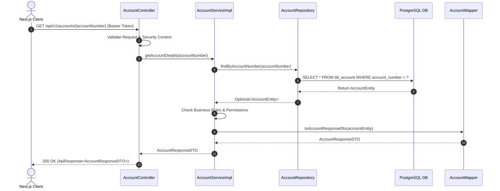

# Architecture & System Design Document - Digital Banking Platform

## 10. System Architecture

### 10.1 High-Level Architecture Overview

The Digital Banking Platform follows a modern **Modular Monolith Architecture**. Rather than deploying dozens of microservices with associated network overhead and distributed transaction complexities (Saga patterns, partial failures), the monolith is partitioned internally into distinct domain modules with strict isolation boundaries.

```mermaid
graph TB
    subgraph Client Layer
        Web[Next.js 15 Web Application]
        Mobile[Mobile Web View / PWA]
    end

    subgraph Edge & Security Layer
        Nginx[Nginx Reverse Proxy / SSL Termination]
        SpringSec[Spring Security 6 Gatekeeper Filter Chain]
        RateLimiter[Redis Rate Limiter Filter]
    end

    subgraph Monolith Core Application - Spring Boot 3
        subgraph Domain Modules
            AuthMod[auth module]
            UserMod[user/customer module]
            AccountMod[account module]
            TxMod[transfer & transaction module]
            SavingsMod[savings deposit module]
            NotifMod[notification module]
            AdminMod[admin audit module]
        end
        
        subgraph Shared Core Infrastructure
            SecurityContext[Security Context]
            EventBus[Internal Application Event Publisher]
            GlobalExcept[Global Exception Handler RFC 7807]
        end
    end

    subgraph Data Infrastructure
        Postgres[(PostgreSQL Primary DB)]
        RedisCache[(Redis Cache & Session Store)]
        RabbitMQBus[RabbitMQ Message Broker]
    end

    Web -->|HTTPS REST API / JSON| Nginx
    Web -->|WSS STOMP| Nginx
    Nginx --> RateLimiter
    RateLimiter --> SpringSec
    SpringSec --> Monolith Core Application - Spring Boot 3
    
    TxMod -->|Read/Write| Postgres
    AccountMod -->|Read/Write| Postgres
    AuthMod -->|Session Token/OTP| RedisCache
    NotifMod -->|Async Events| RabbitMQBus
```

---

## 14. Backend Package Structure (Feature-Based Architecture)

To enforce low coupling and high cohesion, the project uses **Feature-Based Packaging** (Package-by-Feature) rather than traditional Layer-Based Packaging (Package-by-Layer). Every domain functionality resides within its own isolated package hierarchy.

### Directory Tree Overview

```text
com.bank.digital
├── DigitalBankingApplication.java
├── config/
│   ├── SecurityConfig.java
│   ├── RedisConfig.java
│   ├── RabbitMQConfig.java
│   ├── WebSocketConfig.java
│   ├── OpenAPIConfig.java
│   └── JpaAuditingConfig.java
├── common/
│   ├── annotation/
│   │   └── Idempotent.java
│   ├── dto/
│   │   ├── ApiResponse.java
│   │   └── PageResponse.java
│   ├── exception/
│   │   ├── BusinessException.java
│   │   ├── ErrorCode.java
│   │   └── GlobalExceptionHandler.java
│   ├── model/
│   │   └── BaseAuditEntity.java
│   └── util/
│       └── SecurityUtils.java
├── module/
│   ├── auth/
│   │   ├── controller/
│   │   │   └── AuthController.java
│   │   ├── dto/
│   │   │   ├── request/
│   │   │   │   ├── LoginRequest.java
│   │   │   │   ├── RegisterRequest.java
│   │   │   │   └── OtpVerificationRequest.java
│   │   │   └── response/
│   │   │       ├── AuthResponse.java
│   │   │       └── UserProfileResponse.java
│   │   ├── entity/
│   │   │   ├── UserEntity.java
│   │   │   └── RoleEntity.java
│   │   ├── mapper/
│   │   │   └── UserMapper.java
│   │   ├── repository/
│   │   │   └── UserRepository.java
│   │   └── service/
│   │       ├── AuthService.java
│   │       └── impl/
│   │           └── AuthServiceImpl.java
│   ├── account/
│   │   ├── controller/AccountController.java
│   │   ├── dto/...
│   │   ├── entity/AccountEntity.java
│   │   ├── repository/AccountRepository.java
│   │   └── service/...
│   ├── transfer/
│   │   ├── controller/TransferController.java
│   │   ├── dto/...
│   │   ├── entity/TransactionEntity.java
│   │   ├── repository/TransactionRepository.java
│   │   └── service/...
│   ├── savings/
│   │   ├── controller/SavingsController.java
│   │   ├── entity/SavingsAccountEntity.java
│   │   └── scheduler/SavingsInterestScheduler.java
│   ├── notification/
│   │   ├── consumer/NotificationEventConsumer.java
│   │   ├── service/WebSocketNotificationService.java
│   │   └── dto/...
│   └── admin/
│       ├── controller/AdminDashboardController.java
│       └── service/AuditLogService.java
```

---

## 15. Frontend Folder Structure (Next.js 15 App Router)

The frontend application leverages **Next.js 15 App Router**, utilizing Server Components for optimal rendering performance, Server Actions where appropriate, and Client Components for dynamic user interactions (forms, dashboards, charts).

```text
digital-banking-ui/
├── src/
│   ├── app/
│   │   ├── (auth)/
│   │   │   ├── login/
│   │   │   │   └── page.tsx
│   │   │   ├── register/
│   │   │   │   └── page.tsx
│   │   │   └── layout.tsx
│   │   ├── (dashboard)/
│   │   │   ├── layout.tsx
│   │   │   ├── dashboard/
│   │   │   │   └── page.tsx
│   │   │   ├── accounts/
│   │   │   │   └── page.tsx
│   │   │   ├── transfers/
│   │   │   │   └── page.tsx
│   │   │   ├── savings/
│   │   │   │   └── page.tsx
│   │   │   └── settings/
│   │   │       └── page.tsx
│   │   ├── (admin)/
│   │   │   ├── admin/
│   │   │   │   ├── users/page.tsx
│   │   │   │   └── audit-logs/page.tsx
│   │   │   └── layout.tsx
│   │   ├── api/
│   │   │   └── auth/[...nextauth]/route.ts
│   │   ├── global.css
│   │   ├── layout.tsx
│   │   └── page.tsx
│   ├── components/
│   │   ├── ui/                 # Atomic shadcn/ui components (Button, Dialog, Form, Input, Select)
│   │   ├── layout/             # Navbar, Sidebar, Footer, UserMenu
│   │   ├── shared/             # DataTable, Modal, LoadingSpinner, NotificationBell
│   │   └── providers/          # QueryClientProvider, ThemeProvider, WebSocketProvider
│   ├── features/
│   │   ├── auth/               # Components, hooks, types specific to Auth
│   │   │   ├── components/LoginForm.tsx
│   │   │   ├── hooks/useAuth.ts
│   │   │   └── api/authApi.ts
│   │   ├── accounts/
│   │   ├── transfers/
│   │   │   ├── components/TransferForm.tsx
│   │   │   ├── components/OtpModal.tsx
│   │   │   └── hooks/useTransfer.ts
│   │   └── savings/
│   ├── hooks/                  # Cross-cutting custom React hooks (useMediaQuery, useDebounce)
│   ├── lib/                    # Library configurations (axios.ts, query-client.ts, utils.ts)
│   ├── services/               # Axios API client modules
│   ├── types/                  # Global TypeScript interfaces & DTO definitions
│   └── middleware.ts           # Route Protection Guard & JWT verification middleware
├── public/                     # Static assets, branding logos, icons
├── tailwind.config.js
├── tsconfig.json
└── package.json
```

---

## 16. Backend Request Lifecycle Execution

The request lifecycle in Spring Boot follows strict layer isolation:



---

## 17. Frontend Architecture & State Strategy

### 17.1 Client-Side Data Management (TanStack Query + Axios)
- **TanStack Query v5**: Handles caching, automatic background revalidation, optimistic updates, and loading/error states for all server-originating data.
- **Axios Instance**: Configured with `withCredentials: true` for automatic HttpOnly cookie transmission, global error interceptors for automatic JWT renewal on `401 Unauthorized`.

```typescript
// Example Lib Axios Interceptor pattern
import axios from 'axios';

export const apiClient = axios.create({
  baseURL: process.env.NEXT_PUBLIC_API_URL,
  withCredentials: true,
  headers: { 'Content-Type': 'application.json' },
});

apiClient.interceptors.response.use(
  (response) => response,
  async (error) => {
    const originalRequest = error.config;
    if (error.response?.status === 401 && !originalRequest._retry) {
      originalRequest._retry = true;
      await apiClient.post('/api/v1/auth/refresh-token');
      return apiClient(originalRequest);
    }
    return Promise.reject(error);
  }
);
```
