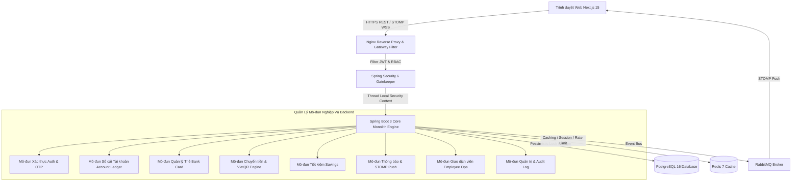

# Tài Liệu Kiến Trúc & Thiết Kế Hệ Thống (System Architecture & Design Document)

## 10. Kiến Trúc Tổng Thể Hệ Thống (System Architecture)

Dự án được thiết kế theo mô hình **Modular Monolith** kết hợp với kiến trúc **Clean Architecture / Hexagonal Architecture** ở Backend và **App Router (Next.js 15)** ở Frontend.



---

## 15. Cấu Trúc Mã Nguồn Frontend (Next.js 15 App Router)

Mã nguồn Frontend nằm tại thư mục `frontend/src` và được tổ chức theo chuẩn Next.js 15 App Router:

```text
frontend/src/
├── app/
│   ├── (dashboard)/            # Phân hệ Khách hàng (Customer Portal)
│   │   ├── accounts/           # Trang Quản lý tài khoản thanh toán & sao kê
│   │   ├── beneficiaries/      # Trang Danh bạ người thụ hưởng
│   │   ├── bills/              # Trang Thanh toán hóa đơn & nạp tiền điện thoại
│   │   ├── cards/              # Trang Quản lý Thẻ (Debit/Credit/Virtual, Khóa thẻ, Đổi PIN)
│   │   ├── dashboard/          # Trang Chủ tổng quan tài khoản & biểu đồ dòng tiền
│   │   ├── notifications/      # Trang Trung tâm Thông báo biến động số dư & bảo mật
│   │   ├── qr-pay/             # Trang Thanh toán VietQR NAPAS 247 & Quét mã QR
│   │   ├── savings/            # Trang Gửi tiết kiệm online & tất toán
│   │   ├── settings/           # Trang Cài đặt cá nhân & đổi mật khẩu
│   │   ├── transactions/       # Trang Lịch sử giao dịch & xuất sao kê PDF/Excel
│   │   └── transfers/          # Trang Chuyển tiền nội bộ & liên ngân hàng 24/7
│   ├── admin/                  # Phân hệ Quản trị (Admin Portal)
│   │   ├── audit/              # Trang Nhật ký vết thao tác (Audit Logs)
│   │   ├── dashboard/          # Trang Dashboard thống kê sức khỏe hệ thống
│   │   ├── roles/              # Trang Quản lý phân quyền RBAC
│   │   ├── system/             # Trang Cấu hình hệ thống & Feature Toggles
│   │   └── users/              # Trang Quản lý nhân viên nội bộ
│   ├── employee/               # Phân hệ Giao dịch viên (Teller Portal)
│   │   ├── accounts/           # Trang Mở & Khóa tài khoản tại quầy
│   │   ├── cash-ops/           # Trang Giao dịch Nộp / Rút tiền mặt tại quầy
│   │   ├── customers/          # Trang Tra cứu hồ sơ khách hàng
│   │   ├── dashboard/          # Trang Dashboard giao dịch viên
│   │   ├── kyc/                # Trang Phê duyệt hồ sơ định danh eKYC
│   │   └── transactions/       # Trang Tra cứu & Soát xét giao dịch
│   ├── login/                  # Trang Đăng nhập
│   ├── register/               # Trang Đăng ký trực tuyến
│   ├── globals.css             # Stylesheet toàn cục với Tailwind CSS
│   └── layout.tsx              # Root Layout toàn ứng dụng
├── components/                 # Các UI Components tái sử dụng
│   ├── admin/                  # Components giao dịch Admin (AdminSidebar...)
│   ├── employee/               # Components giao dịch Employee (EmployeeSidebar...)
│   ├── layout/                 # Layout chính (Sidebar, Header...)
│   └── ui/                     # UI Primitives (Button, Modal, Card...)
├── lib/
│   ├── api/                    # Axios API Client instances & Services
│   ├── mock/                   # Dữ liệu giả lập (cardsData, notificationsData...)
│   └── types/                  # TypeScript Types & Interfaces (cards, notifications, admin...)
└── providers/                  # React Context & TanStack Query Providers
```

---

## 17. Quản Lý Trạng Thái & Tích Hợp API (State Management Strategy)

1. **Server State (TanStack Query v5)**: Quản lý việc fetch, cache và revalidate dữ liệu từ backend (tài khoản, danh sách thẻ, thông báo, nhật ký giao dịch).
2. **Local Component State**: Quản lý trạng thái UI ngắn hạn (mở/đóng Modal đổi PIN, chuyển đổi giữa các thẻ, chọn tab quét/tạo mã QR).
3. **Optimistic Updates**: Khi thực hiện khóa/mở khóa thẻ hoặc đánh dấu đã đọc thông báo, UI cập nhật ngay lập tức trước khi nhận phản hồi từ server để tăng độ mượt mà.
