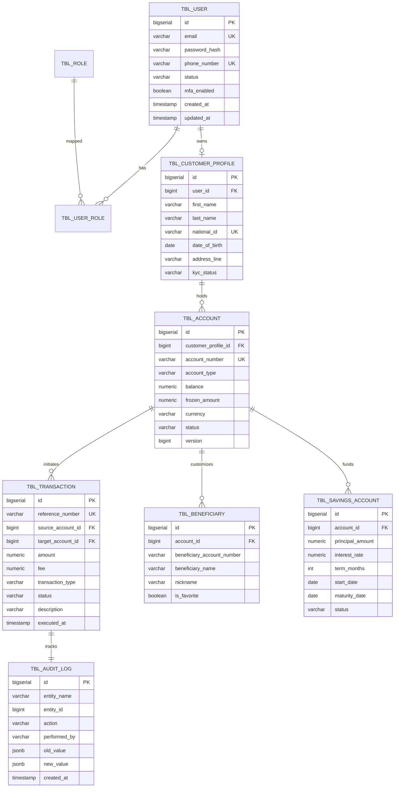

# Database Design & Schema Specification - Digital Banking Platform

## 11. Database Design

The PostgreSQL database is structured to support multi-account financial operations with strict referential integrity, double-entry audit logging, and audit tracking on every record.

### 11.1 Mermaid Entity-Relationship Diagram (ERD)



---

## 11.2 Entity Specifications & Attribute Details

### 1. `tbl_user` (Authentication Core)
| Column Name | Data Type | Constraints | Description |
|---|---|---|---|
| `id` | `BIGSERIAL` | Primary Key | Internal surrogate identifier. |
| `email` | `VARCHAR(150)` | NOT NULL, UNIQUE | User primary login credential & contact email. |
| `password_hash` | `VARCHAR(255)` | NOT NULL | BCrypt hashed security password string. |
| `phone_number` | `VARCHAR(20)` | NOT NULL, UNIQUE | Customer mobile contact number. |
| `status` | `VARCHAR(30)` | NOT NULL, Default `'ACTIVE'` | Account status: `ACTIVE`, `SUSPENDED`, `LOCKED`. |
| `failed_login_attempts` | `INT` | NOT NULL, Default `0` | Failed password attempt counter. |
| `created_at` | `TIMESTAMP` | NOT NULL | Creation timestamp. |
| `updated_at` | `TIMESTAMP` | NOT NULL | Last modification timestamp. |

### 2. `tbl_account` (Core Banking Ledgers)
| Column Name | Data Type | Constraints | Description |
|---|---|---|---|
| `id` | `BIGSERIAL` | Primary Key | Account surrogate key. |
| `customer_profile_id` | `BIGINT` | NOT NULL, FK (`tbl_customer_profile.id`) | Foreign key linking account to owner profile. |
| `account_number` | `VARCHAR(20)` | NOT NULL, UNIQUE, Index | 10-digit customer-facing account number. |
| `account_type` | `VARCHAR(20)` | NOT NULL | `CHECKING`, `SAVINGS`. |
| `balance` | `NUMERIC(18, 4)` | NOT NULL, Check (`balance >= 0`) | Available ledger balance. |
| `frozen_amount` | `NUMERIC(18, 4)` | NOT NULL, Default `0.0000` | Amount locked for pending holds/transfers. |
| `currency` | `VARCHAR(3)` | NOT NULL, Default `'USD'` | ISO 4217 Currency code. |
| `status` | `VARCHAR(20)` | NOT NULL, Default `'ACTIVE'` | Account state: `ACTIVE`, `FROZEN`, `CLOSED`. |
| `version` | `BIGINT` | NOT NULL, Default `0` | Optimistic locking control column for JPA `@Version`. |

---

## 12. Database Naming Conventions

To ensure consistency across migrations, developers must follow these SQL conventions:
- **Tables**: Lowercase singular/plural with `tbl_` prefix (e.g., `tbl_user`, `tbl_account`).
- **Columns**: Lowercase snake_case (e.g., `account_number`, `created_at`).
- **Primary Keys**: Name column `id` with type `BIGSERIAL` / `BIGINT`.
- **Foreign Keys**: Column named `[target_table_singular]_id` (e.g., `customer_profile_id`). Constraint named `fk_[source_table]_[target_table]` (e.g., `fk_tbl_account_tbl_customer_profile`).
- **Unique Indexes**: Constraint named `uk_[table]_[column]` (e.g., `uk_tbl_account_account_number`).
- **Monetary Precision**: All currency balances stored as `NUMERIC(18, 4)` to prevent floating-point rounding errors.

---

## 12.1 Flyway Database Migration (`V1__init_schema.sql`)

```sql
-- Initial Schema Migration Script
CREATE TABLE tbl_user (
    id BIGSERIAL PRIMARY KEY,
    email VARCHAR(150) NOT NULL CONSTRAINT uk_tbl_user_email UNIQUE,
    password_hash VARCHAR(255) NOT NULL,
    phone_number VARCHAR(20) NOT NULL CONSTRAINT uk_tbl_user_phone UNIQUE,
    status VARCHAR(30) NOT NULL DEFAULT 'ACTIVE',
    mfa_enabled BOOLEAN NOT NULL DEFAULT FALSE,
    failed_login_attempts INT NOT NULL DEFAULT 0,
    created_at TIMESTAMP WITH TIME ZONE NOT NULL DEFAULT CURRENT_TIMESTAMP,
    updated_at TIMESTAMP WITH TIME ZONE NOT NULL DEFAULT CURRENT_TIMESTAMP
);

CREATE TABLE tbl_customer_profile (
    id BIGSERIAL PRIMARY KEY,
    user_id BIGINT NOT NULL CONSTRAINT fk_customer_profile_user REFERENCES tbl_user(id) ON DELETE CASCADE,
    first_name VARCHAR(50) NOT NULL,
    last_name VARCHAR(50) NOT NULL,
    national_id VARCHAR(30) NOT NULL CONSTRAINT uk_customer_national_id UNIQUE,
    date_of_birth DATE NOT NULL,
    address_line VARCHAR(255),
    kyc_status VARCHAR(20) NOT NULL DEFAULT 'PENDING',
    created_at TIMESTAMP WITH TIME ZONE NOT NULL DEFAULT CURRENT_TIMESTAMP
);

CREATE TABLE tbl_account (
    id BIGSERIAL PRIMARY KEY,
    customer_profile_id BIGINT NOT NULL CONSTRAINT fk_tbl_account_customer REFERENCES tbl_customer_profile(id),
    account_number VARCHAR(20) NOT NULL CONSTRAINT uk_tbl_account_number UNIQUE,
    account_type VARCHAR(20) NOT NULL,
    balance NUMERIC(18, 4) NOT NULL CONSTRAINT chk_account_balance CHECK (balance >= 0),
    frozen_amount NUMERIC(18, 4) NOT NULL DEFAULT 0.0000,
    currency VARCHAR(3) NOT NULL DEFAULT 'USD',
    status VARCHAR(20) NOT NULL DEFAULT 'ACTIVE',
    version BIGINT NOT NULL DEFAULT 0,
    created_at TIMESTAMP WITH TIME ZONE NOT NULL DEFAULT CURRENT_TIMESTAMP,
    updated_at TIMESTAMP WITH TIME ZONE NOT NULL DEFAULT CURRENT_TIMESTAMP
);

CREATE INDEX idx_tbl_account_number ON tbl_account(account_number);
CREATE INDEX idx_tbl_account_customer ON tbl_account(customer_profile_id);
```
