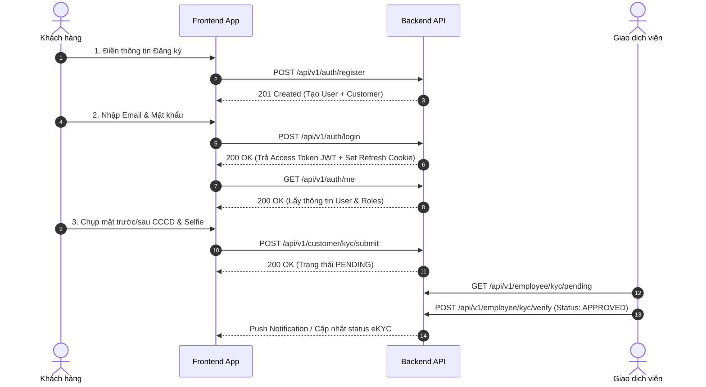
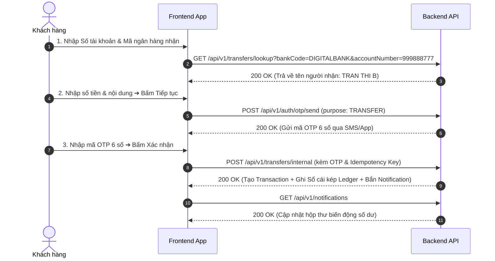
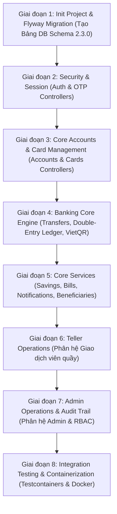

# Đặc Tả REST API Specification & Lộ Trình Triển Khai - Digital Banking Platform

> **API Base URL**: `https://api.digitalbank.vn/api/v1`  
> **Định dạng dữ liệu**: `application/json; charset=utf-8`  
> **Chuẩn báo lỗi**: RFC 7807 (Problem Details for HTTP APIs)  
> **Xác thực**: JWT Bearer Token trong Header (`Authorization: Bearer <token>`) & HttpOnly Refresh Cookie

---

## 🗺️ PHẦN I: ĐƯỜNG ĐI & QUY TRÌNH GỌI API THEO LUỒNG NGHIỆP VỤ (END-TO-END API PATHS)

---

### 1. Luồng Đăng Ký, Đăng Nhập & Định Danh eKYC Level 2



---

### 2. Luồng Chuyển Tiền Nội Bộ / Liên Ngân Hàng 24/7 (Internal & Napas 247)



---

## 📋 PHẦN II: TỔNG HỢP DANH MỤC TOÀN BỘ 50+ REST API ENDPOINTS

### 1. Mô-đun Xác Thực & Quản Lý Phiên (Auth & Session - `/api/v1/auth`)

| HTTP Method | Endpoint | Mô Tả Nghiệp Vụ | Quyền Hạn (Permission) | Bảng DB Liên Quan |
|---|---|---|---|---|
| `POST` | `/auth/register` | Đăng ký tài khoản khách hàng trực tuyến mới | Public | `users`, `customers` |
| `POST` | `/auth/login` | Đăng nhập (Trả về JWT + HttpOnly Cookie Refresh Token) | Public | `users`, `refresh_tokens`, `audit_logs` |
| `POST` | `/auth/refresh` | Làm mới JWT Access Token bằng Refresh Token | Public (Cookie) | `refresh_tokens` |
| `POST` | `/auth/logout` | Đăng xuất & Thu hồi Refresh Token | Authenticated | `refresh_tokens` |
| `GET` | `/auth/me` | Lấy thông tin người dùng đang đăng nhập & danh sách Permissions | Authenticated | `users`, `user_roles`, `roles` |
| `POST` | `/auth/otp/send` | Yêu cầu gửi mã OTP (Tạo giao dịch, Đổi PIN, Quên mật khẩu) | Authenticated | `otp_codes` |
| `POST` | `/auth/otp/verify` | Xác minh mã OTP | Authenticated | `otp_codes` |
| `POST` | `/auth/forgot-password` | Yêu cầu mã khôi phục mật khẩu | Public | `otp_codes` |
| `POST` | `/auth/reset-password` | Đặt lại mật khẩu mới | Public | `users`, `otp_codes` |

---

### 2. Mô-đun Hồ Sơ Khách Hàng & eKYC (Customer & eKYC - `/api/v1/customer`)

| HTTP Method | Endpoint | Mô Tả Nghiệp Vụ | Quyền Hạn | Bảng DB Liên Quan |
|---|---|---|---|---|
| `GET` | `/customer/profile` | Lấy thông tin hồ sơ khách hàng cá nhân | `ROLE_CUSTOMER` | `customers`, `users` |
| `PUT` | `/customer/profile` | Cập nhật thông tin cá nhân (Địa chỉ, Avatar) | `ROLE_CUSTOMER` | `customers` |
| `POST` | `/customer/kyc/submit` | Nộp ảnh CCCD (Mặt trước/sau) & Chân dung eKYC Level 2 | `ROLE_CUSTOMER` | `kyc_documents` |
| `GET` | `/customer/kyc/status` | Tra cứu trạng thái phê duyệt định danh eKYC | `ROLE_CUSTOMER` | `kyc_documents` |

---

### 3. Mô-đun Tài Khoản Thanh Toán (Accounts - `/api/v1/accounts`)

| HTTP Method | Endpoint | Mô Tả Nghiệp Vụ | Quyền Hạn | Bảng DB Liên Quan |
|---|---|---|---|---|
| `GET` | `/accounts` | Danh sách tài khoản thanh toán của khách hàng | `ROLE_CUSTOMER` | `accounts` |
| `GET` | `/accounts/{id}` | Xem chi tiết số dư tài khoản (Khả dụng, Phong tỏa) | `ROLE_CUSTOMER` | `accounts` |
| `GET` | `/accounts/{id}/statement` | Tải sao kê chi tiết tài khoản (JSON / PDF / Excel) | `ROLE_CUSTOMER` | `accounts`, `transactions`, `ledger_entries` |

---

### 4. Mô-đun Quản Lý Thẻ Ngân Hàng (Cards - `/api/v1/cards`)

| HTTP Method | Endpoint | Mô Tả Nghiệp Vụ | Quyền Hạn | Bảng DB Liên Quan |
|---|---|---|---|---|
| `GET` | `/cards` | Danh sách thẻ (Debit, Credit & Virtual Card) | `ROLE_CUSTOMER` | `cards`, `accounts` |
| `GET` | `/cards/{id}` | Xem thông tin chi tiết thẻ (Số thẻ ẩn, Ngày hết hạn) | `ROLE_CUSTOMER` | `cards` |
| `PUT` | `/cards/{id}/status` | Khóa hoặc Mở khóa thẻ khẩn cấp (`ACTIVE` / `LOCKED`) | `ROLE_CUSTOMER` | `cards` |
| `PUT` | `/cards/{id}/pin` | Đổi mã PIN 6 số cho thẻ (Yêu cầu xác thực OTP) | `ROLE_CUSTOMER` | `cards`, `otp_codes` |
| `PUT` | `/cards/{id}/limits` | Điều chỉnh hạn mức giao dịch Online / ATM / POS hàng ngày | `ROLE_CUSTOMER` | `cards` |
| `POST` | `/cards/virtual` | Đăng ký phát hành Thẻ ảo phi vật lý Visa Virtual tức thì | `ROLE_CUSTOMER` | `cards`, `accounts` |
| `GET` | `/cards/{id}/transactions` | Tra cứu lịch sử giao dịch bằng thẻ | `ROLE_CUSTOMER` | `card_transactions` |

---

### 5. Mô-đun Chuyển Tiền & VietQR (Transfers & QR - `/api/v1/transfers`, `/api/v1/qr`)

| HTTP Method | Endpoint | Mô Tả Nghiệp Vụ | Quyền Hạn | Bảng DB Liên Quan |
|---|---|---|---|---|
| `GET` | `/transfers/lookup` | Tra cứu tự động tên người thụ hưởng (Nội bộ & Napas 247) | `ROLE_CUSTOMER` | `accounts`, `customers` |
| `POST` | `/transfers/internal` | Chuyển tiền nội bộ ngân hàng (Tạo sổ cái kép & Audit) | `ROLE_CUSTOMER` | `transactions`, `ledger_entries`, `accounts`, `notifications`, `audit_logs` |
| `POST` | `/transfers/interbank` | Chuyển tiền nhanh liên ngân hàng 24/7 (Napas 247) | `ROLE_CUSTOMER` | `transactions`, `ledger_entries`, `accounts`, `notifications` |
| `POST` | `/qr/generate` | Sinh chuỗi payload & Ảnh mã VietQR chuẩn NAPAS 247 | `ROLE_CUSTOMER` | `accounts` |
| `POST` | `/qr/parse` | Bóc tách thông tin mã QR chuyển tiền từ ảnh/payload | `ROLE_CUSTOMER` | None (Transient Utility) |

---

### 6. Mô-đun Tiết Kiệm Trực Tuyến (Savings - `/api/v1/savings`)

| HTTP Method | Endpoint | Mô Tả Nghiệp Vụ | Quyền Hạn | Bảng DB Liên Quan |
|---|---|---|---|---|
| `GET` | `/savings` | Danh sách các sổ tiết kiệm trực tuyến đang gửi | `ROLE_CUSTOMER` | `savings_accounts` |
| `POST` | `/savings/calculate` | Tính toán số tiền lãi dự kiến nhận được theo kỳ hạn | `ROLE_CUSTOMER` | `system_configs` |
| `POST` | `/savings/open` | Mở sổ tiết kiệm online (Trích tiền từ tài khoản thanh toán) | `ROLE_CUSTOMER` | `savings_accounts`, `accounts`, `transactions`, `ledger_entries` |
| `POST` | `/savings/{id}/withdraw` | Tất toán sổ tiết kiệm (Đúng hạn hoặc trước hạn) | `ROLE_CUSTOMER` | `savings_accounts`, `accounts`, `transactions`, `ledger_entries` |

---

### 7. Mô-đun Thanh Toán Hóa Đơn (Bills & Top-up - `/api/v1/bills`)

| HTTP Method | Endpoint | Mô Tả Nghiệp Vụ | Quyền Hạn | Bảng DB Liên Quan |
|---|---|---|---|---|
| `POST` | `/bills/lookup` | Tra cứu số tiền hóa đơn Điện/Nước/Internet theo mã KH | `ROLE_CUSTOMER` | None |
| `POST` | `/bills/pay` | Thanh toán hóa đơn / Nạp tiền điện thoại | `ROLE_CUSTOMER` | `transactions`, `ledger_entries`, `accounts`, `notifications` |

---

### 8. Mô-đun Danh Bạ Thụ Hưởng (Beneficiaries - `/api/v1/beneficiaries`)

| HTTP Method | Endpoint | Mô Tả Nghiệp Vụ | Quyền Hạn | Bảng DB Liên Quan |
|---|---|---|---|---|
| `GET` | `/beneficiaries` | Lấy sổ địa chỉ người nhận tiền thường xuyên | `ROLE_CUSTOMER` | `beneficiaries` |
| `POST` | `/beneficiaries` | Lưu người thụ hưởng mới | `ROLE_CUSTOMER` | `beneficiaries` |
| `PUT` | `/beneficiaries/{id}` | Cập nhật biệt danh / thông tin người thụ hưởng | `ROLE_CUSTOMER` | `beneficiaries` |
| `DELETE` | `/beneficiaries/{id}` | Xóa người thụ hưởng khỏi sổ địa chỉ | `ROLE_CUSTOMER` | `beneficiaries` |

---

### 9. Mô-đun Lịch Sử Giao Dịch (Transactions - `/api/v1/transactions`)

| HTTP Method | Endpoint | Mô Tả Nghiệp Vụ | Quyền Hạn | Bảng DB Liên Quan |
|---|---|---|---|---|
| `GET` | `/transactions` | Tra cứu & Lọc lịch sử giao dịch (Thời gian, Loại +/-) | `ROLE_CUSTOMER` | `transactions`, `ledger_entries` |
| `GET` | `/transactions/{id}` | Xem chi tiết biên lai giao dịch thành công | `ROLE_CUSTOMER` | `transactions` |
| `GET` | `/transactions/export` | Xuất báo cáo giao dịch dạng PDF / Excel | `ROLE_CUSTOMER` | `transactions`, `ledger_entries` |

---

### 10. Mô-đun Trung Tâm Thông Báo (Notifications - `/api/v1/notifications`)

| HTTP Method | Endpoint | Mô Tả Nghiệp Vụ | Quyền Hạn | Bảng DB Liên Quan |
|---|---|---|---|---|
| `GET` | `/notifications` | Danh sách thông báo (Biến động số dư, Cảnh báo bảo mật) | `ROLE_CUSTOMER` | `notifications` |
| `PUT` | `/notifications/{id}/read` | Đánh dấu một thông báo là ĐÃ ĐỌC | `ROLE_CUSTOMER` | `notifications` |
| `PUT` | `/notifications/read-all` | Đánh dấu tất cả thông báo là ĐÃ ĐỌC | `ROLE_CUSTOMER` | `notifications` |
| `DELETE` | `/notifications/{id}` | Xóa thông báo khỏi hộp thư | `ROLE_CUSTOMER` | `notifications` |

---

### 11. Mô-đun Nghiệp Vụ Giao Dịch Viên (Employee / Teller Ops - `/api/v1/employee`)

| HTTP Method | Endpoint | Mô Tả Nghiệp Vụ | Quyền Hạn (Permission) | Bảng DB Liên Quan |
|---|---|---|---|---|
| `GET` | `/employee/dashboard` | Thống kê chỉ số làm việc trong ngày của Giao dịch viên | `ROLE_EMPLOYEE` | `cash_transactions`, `kyc_documents` |
| `GET` | `/employee/customers/search` | Tra cứu hồ sơ khách hàng theo CCCD, SĐT, STK | `CUSTOMER_READ` | `customers`, `users`, `accounts` |
| `POST` | `/employee/accounts/open` | Mở tài khoản thanh toán cho khách hàng tại quầy | `EMPLOYEE_MANAGE` | `accounts`, `customers` |
| `PUT` | `/employee/accounts/{id}/status` | Khóa / Phong tỏa tài khoản do rủi ro | `ACCOUNT_FREEZE` | `accounts`, `audit_logs` |
| `GET` | `/employee/kyc/pending` | Danh sách hồ sơ eKYC Level 2 đang chờ phê duyệt | `KYC_VERIFY` | `kyc_documents`, `customers` |
| `POST` | `/employee/kyc/verify` | Phê duyệt hoặc Từ chối hồ sơ eKYC | `KYC_VERIFY` | `kyc_documents`, `customers`, `audit_logs` |
| `POST` | `/employee/cash/deposit` | Thực hiện Nộp tiền mặt vào tài khoản tại quầy | `CASH_DEPOSIT` | `cash_transactions`, `accounts`, `ledger_entries`, `audit_logs` |
| `POST` | `/employee/cash/withdraw` | Thực hiện Rút tiền mặt từ tài khoản tại quầy | `CASH_WITHDRAW` | `cash_transactions`, `accounts`, `ledger_entries`, `audit_logs` |
| `GET` | `/employee/transactions/audit` | Tra cứu & Soát xét các giao dịch nghi vấn | `AUDIT_LOG_VIEW` | `transactions`, `ledger_entries` |

---

### 12. Mô-đun Quản Trị Hệ Thống & Audit (Admin & Audit - `/api/v1/admin`)

| HTTP Method | Endpoint | Mô Tả Nghiệp Vụ | Quyền Hạn (Permission) | Bảng DB Liên Quan |
|---|---|---|---|---|
| `GET` | `/admin/dashboard/stats` | Thống kê sức khỏe hệ thống, tổng CASA, tốc độ API | `ROLE_ADMIN` | `accounts`, `users`, `transactions` |
| `GET` | `/admin/users` | Danh sách tài khoản nhân viên nội bộ | `EMPLOYEE_MANAGE` | `users`, `employees`, `branches` |
| `POST` | `/admin/users` | Tạo tài khoản Giao dịch viên / Kiểm soát viên mới | `EMPLOYEE_MANAGE` | `users`, `employees`, `user_roles` |
| `PUT` | `/admin/users/{id}/status` | Khóa / Kích hoạt tài khoản nhân viên | `EMPLOYEE_MANAGE` | `users`, `audit_logs` |
| `GET` | `/admin/roles` | Lấy danh sách Vai trò & Ma trận phân quyền RBAC | `ROLE_MANAGE` | `roles`, `permissions`, `role_permissions` |
| `PUT` | `/admin/roles/{id}/permissions` | Cập nhật gán/bớt quyền hạn cho từng vai trò | `ROLE_MANAGE` | `role_permissions` |
| `GET` | `/admin/audit-logs` | Tra cứu vết thao tác (Audit Trail) toàn hệ thống | `AUDIT_LOG_VIEW` | `audit_logs`, `users` |
| `GET` | `/admin/configs` | Danh sách tham số cấu hình hệ thống | `SYSTEM_CONFIG` | `system_configs` |
| `PUT` | `/admin/configs/{key}` | Cập nhật hạn mức giao dịch, lãi suất, chế độ bảo trì | `SYSTEM_CONFIG` | `system_configs`, `audit_logs` |

---

## 📋 PHẦN III: CHI TIẾT REQUEST & RESPONSE JSON DTOs CHO TẤT CẢ 50+ APIs

#### 1.1 `POST /api/v1/auth/register` - Đăng Ký Tài Khoản Khách Hàng Trực Tuyến
- **Request Body**:
```json
{
  "fullName": "NGUYEN VAN A",
  "email": "nguyenvana@gmail.com",
  "phoneNumber": "0988123456",
  "nationalId": "001099887766",
  "password": "Password@123"
}
```
- **Response (201 Created)**:
```json
{
  "success": true,
  "message": "Đăng ký tài khoản thành công",
  "data": {
    "userId": "usr_998877665544332211",
    "customerCode": "CUST-100293",
    "email": "nguyenvana@gmail.com",
    "phoneNumber": "0988123456",
    "status": "ACTIVE"
  }
}
```

#### 1.2 `POST /api/v1/auth/login` - Đăng Nhập Hệ Thống
- **Request Body**:
```json
{
  "username": "nguyenvana@gmail.com",
  "password": "Password@123",
  "deviceInfo": "Windows 11 Chrome 126"
}
```
- **Response (200 OK)** (Đồng thời Set Cookie `refreshToken` HttpOnly):
```json
{
  "success": true,
  "tokenType": "Bearer",
  "accessToken": "eyJhbGciOiJIUzI1NiIsInR5cCI6IkpXVCJ9...",
  "expiresIn": 900,
  "user": {
    "userId": "usr_998877665544332211",
    "fullName": "NGUYEN VAN A",
    "email": "nguyenvana@gmail.com",
    "roles": ["ROLE_CUSTOMER"]
  }
}
```

#### 1.3 `POST /api/v1/auth/refresh` - Làm Mới Access Token
- **Request**: Cookie `refreshToken`.
- **Response (200 OK)**:
```json
{
  "success": true,
  "tokenType": "Bearer",
  "accessToken": "eyJhbGciOiJIUzI1NiIsInR5cCI6IkpXVCJ9...",
  "expiresIn": 900
}
```

#### 1.4 `POST /api/v1/auth/logout` - Đăng Xuất & Thu Hỏi Refresh Token
- **Response (200 OK)**:
```json
{
  "success": true,
  "message": "Đăng xuất thành công"
}
```

#### 1.5 `GET /api/v1/auth/me` - Lấy Thông Tin Người Dùng & Quyền Hạn
- **Response (200 OK)**:
```json
{
  "userId": "usr_998877665544332211",
  "fullName": "NGUYEN VAN A",
  "email": "nguyenvana@gmail.com",
  "phone": "0988123456",
  "roles": ["ROLE_CUSTOMER"],
  "permissions": ["ACCOUNT_READ", "TRANSFER_EXECUTE", "CARD_MANAGE"]
}
```

#### 1.6 `POST /api/v1/auth/otp/send` - Yêu Cầu Gửi Mã OTP
- **Request Body**:
```json
{
  "purpose": "TRANSFER"
}
```
- **Response (200 OK)**:
```json
{
  "success": true,
  "message": "Mã OTP 6 số đã gửi tới số điện thoại 0988***456",
  "expiresInSeconds": 180
}
```

#### 1.7 `POST /api/v1/auth/otp/verify` - Xác Minh Mã OTP
- **Request Body**:
```json
{
  "purpose": "TRANSFER",
  "otpCode": "889900"
}
```
- **Response (200 OK)**:
```json
{
  "valid": true,
  "message": "Xác minh mã OTP hợp lệ"
}
```

#### 1.8 `POST /api/v1/auth/forgot-password` - Yêu Cầu Quên Mật Khẩu
- **Request Body**:
```json
{
  "email": "nguyenvana@gmail.com"
}
```
- **Response (200 OK)**:
```json
{
  "success": true,
  "message": "Mã OTP khôi phục mật khẩu đã gửi về email"
}
```

#### 1.9 `POST /api/v1/auth/reset-password` - Đặt Lại Mật Khẩu Mới
- **Request Body**:
```json
{
  "email": "nguyenvana@gmail.com",
  "otpCode": "123456",
  "newPassword": "NewPassword@123"
}
```
- **Response (200 OK)**:
```json
{
  "success": true,
  "message": "Đã khôi phục mật khẩu thành công. Vui lòng đăng nhập lại."
}
```

#### 2.1 `GET /api/v1/customer/profile` - Xem Hồ Sơ Khách Hàng
- **Response (200 OK)**:
```json
{
  "customerId": "cust_100293",
  "customerCode": "CUST-100293",
  "fullName": "NGUYEN VAN A",
  "email": "nguyenvana@gmail.com",
  "phone": "0988123456",
  "nationalId": "001099887766",
  "dateOfBirth": "1995-08-15",
  "address": "123 Đường Cầu Giấy, Hà Nội",
  "avatarUrl": "https://cdn.digitalbank.vn/avatars/usr_101.jpg",
  "kycStatus": "APPROVED"
}
```

#### 2.2 `PUT /api/v1/customer/profile` - Cập Nhật Hồ Sơ Cá Nhân
- **Request Body**:
```json
{
  "address": "456 Nam Kỳ Khởi Nghĩa, Quận 3, TP.HCM",
  "avatarUrl": "https://cdn.digitalbank.vn/avatars/usr_101_new.jpg"
}
```
- **Response (200 OK)**:
```json
{
  "success": true,
  "message": "Cập nhật hồ sơ thành công"
}
```

#### 2.3 `POST /api/v1/customer/kyc/submit` - Nộp Hồ Sơ eKYC Level 2
- **Request Body**:
```json
{
  "frontIdCardUrl": "https://cdn.digitalbank.vn/kyc/front_001.jpg",
  "backIdCardUrl": "https://cdn.digitalbank.vn/kyc/back_001.jpg",
  "selfiePhotoUrl": "https://cdn.digitalbank.vn/kyc/selfie_001.jpg"
}
```
- **Response (200 OK)**:
```json
{
  "success": true,
  "kycDocumentId": "kyc_doc_8899",
  "status": "PENDING",
  "message": "Hồ sơ eKYC đã gửi thành công"
}
```

#### 2.4 `GET /api/v1/customer/kyc/status` - Trạng Thái eKYC
- **Response (200 OK)**:
```json
{
  "kycStatus": "APPROVED",
  "submittedAt": "2026-07-30T10:00:00Z",
  "verifiedAt": "2026-07-30T10:15:00Z"
}
```

#### 3.1 `GET /api/v1/accounts` - Danh Sách Tài Khoản Thanh Toán
- **Response (200 OK)**:
```json
[
  {
    "accountId": "acc_1001",
    "accountNumber": "1029384756",
    "balance": 125400000.00,
    "frozenBalance": 0.00,
    "availableBalance": 125400000.00,
    "currency": "VND",
    "accountType": "CHECKING",
    "status": "ACTIVE"
  }
]
```

#### 3.2 `GET /api/v1/accounts/{id}` - Chi Tiết Tài Khoản
- **Response (200 OK)**:
```json
{
  "accountId": "acc_1001",
  "accountNumber": "1029384756",
  "balance": 125400000.00,
  "frozenBalance": 0.00,
  "availableBalance": 125400000.00,
  "currency": "VND",
  "status": "ACTIVE"
}
```

#### 3.3 `GET /api/v1/accounts/{id}/statement` - Báo Cáo Sao Kê Tài Khoản
- **Query Params**: `?fromDate=2026-07-01&toDate=2026-07-30`
- **Response (200 OK)**:
```json
{
  "accountNumber": "1029384756",
  "openingBalance": 111650000.00,
  "closingBalance": 125400000.00,
  "entries": [
    {
      "transactionCode": "FT2621188992",
      "entryTime": "2026-07-30T17:30:00Z",
      "entryType": "CREDIT",
      "amount": 15000000.00,
      "balanceAfter": 126650000.00,
      "description": "Thanh toan luong thang 07/2026"
    }
  ]
}
```

#### 4.1 `GET /api/v1/cards` - Danh Sách Thẻ
- **Response (200 OK)**:
```json
[
  {
    "cardId": "card_001",
    "maskedNumber": "4123 **** **** 8888",
    "cardType": "DEBIT",
    "network": "VISA",
    "status": "ACTIVE",
    "expiryMonth": 8,
    "expiryYear": 2028,
    "linkedAccountNumber": "1029384756",
    "availableBalance": 125400000.00
  }
]
```

#### 4.2 `PUT /api/v1/cards/{id}/status` - Khóa / Mở Khóa Thẻ Khẩn Cấp
- **Request Body**:
```json
{
  "status": "LOCKED"
}
```
- **Response (200 OK)**:
```json
{
  "success": true,
  "message": "Đã khóa thẻ 4123 **** **** 8888 thành công!",
  "cardId": "card_001",
  "newStatus": "LOCKED"
}
```

#### 4.3 `PUT /api/v1/cards/{id}/pin` - Đổi Mã PIN Thẻ
- **Request Body**:
```json
{
  "newPin": "654321",
  "otpCode": "123456"
}
```
- **Response (200 OK)**:
```json
{
  "success": true,
  "message": "Đã đổi mã PIN thẻ thành công!"
}
```

#### 4.4 `PUT /api/v1/cards/{id}/limits` - Đổi Hạn Mức Thẻ
- **Request Body**:
```json
{
  "dailyOnlineLimit": 60000000.00,
  "dailyAtmLimit": 20000000.00,
  "dailyPosLimit": 50000000.00
}
```
- **Response (200 OK)**:
```json
{
  "success": true,
  "message": "Đã cập nhật hạn mức thẻ thành công!"
}
```

#### 4.5 `POST /api/v1/cards/virtual` - Phát Hành Thẻ Ảo
- **Request Body**:
```json
{
  "linkedAccountId": "acc_1001",
  "dailyOnlineLimit": 15000000.00
}
```
- **Response (201 Created)**:
```json
{
  "success": true,
  "card": {
    "cardId": "card_003",
    "maskedNumber": "4888 **** **** 1234",
    "cardType": "VIRTUAL",
    "network": "VISA",
    "status": "ACTIVE"
  }
}
```

#### 5.1 `GET /api/v1/transfers/lookup` - Tra Cứu Tên Người Thụ Hưởng
- **Query Params**: `?bankCode=DIGITALBANK&accountNumber=999888777`
- **Response (200 OK)**:
```json
{
  "found": true,
  "bankCode": "DIGITALBANK",
  "accountNumber": "999888777",
  "accountHolderName": "TRAN THI B"
}
```

#### 5.2 `POST /api/v1/transfers/internal` - Chuyển Tiền Nội Bộ Ngân Hàng
- **Request Body**:
```json
{
  "sourceAccountId": "acc_1001",
  "targetAccountNumber": "999888777",
  "amount": 500000.00,
  "description": "Nguyen Van A chuyen tien qua app",
  "idempotencyKey": "IDEM-TX-20260730-001299",
  "otpCode": "889900"
}
```
- **Response (200 OK)**:
```json
{
  "success": true,
  "message": "Giao dịch chuyển tiền thành công!",
  "data": {
    "transactionCode": "FT2621188992",
    "sourceAccount": "1029384756",
    "targetAccount": "999888777",
    "targetAccountName": "TRAN THI B",
    "amount": 500000.00,
    "balanceAfter": 124900000.00,
    "status": "SUCCESS",
    "timestamp": "2026-07-30T22:30:00Z"
  }
}
```

#### 5.3 `POST /api/v1/transfers/interbank` - Chuyển Tiền Napas 247
- **Request Body**:
```json
{
  "sourceAccountId": "acc_1001",
  "targetBankCode": "VCB",
  "targetAccountNumber": "0071000998877",
  "targetAccountName": "TRAN THI B",
  "amount": 350000.00,
  "description": "Chuyen tien Napas 247",
  "idempotencyKey": "IDEM-TX-20260730-009988",
  "otpCode": "112233"
}
```
- **Response (200 OK)**:
```json
{
  "success": true,
  "message": "Chuyển tiền Napas 247 thành công!",
  "data": {
    "transactionCode": "NAPAS-889900",
    "status": "SUCCESS"
  }
}
```

#### 5.4 `POST /api/v1/qr/generate` - Tạo Mã VietQR
- **Request Body**:
```json
{
  "accountNumber": "1029384756",
  "amount": 500000.00,
  "description": "Thanh toan VietQR"
}
```
- **Response (200 OK)**:
```json
{
  "qrPayload": "00020101021238580010A0000007270128000697040701141029384756...",
  "qrImageUrl": "https://api.qrserver.com/v1/create-qr-code/?size=260x260&data=..."
}
```

#### 5.5 `POST /api/v1/qr/parse` - Quét Bóc Tách VietQR
- **Request Body**:
```json
{
  "qrPayload": "00020101021238580010A000000727..."
}
```
- **Response (200 OK)**:
```json
{
  "bankCode": "VCB",
  "bankName": "VIETCOMBANK",
  "accountNumber": "0071000998877",
  "accountName": "TRAN THI B",
  "amount": 350000.00,
  "description": "Thanh toan tien an trua qua QR"
}
```

#### 6.1 `POST /api/v1/savings/calculate` - Tính Tiền Lãi Dự Kiến
- **Request Body**:
```json
{
  "amount": 10000000.00,
  "termMonths": 6
}
```
- **Response (200 OK)**:
```json
{
  "principalAmount": 10000000.00,
  "termMonths": 6,
  "interestRate": 6.5,
  "expectedInterest": 325000.00,
  "totalAtMaturity": 10325000.00
}
```

#### 6.2 `POST /api/v1/savings/open` - Mở Sổ Tiết Kiệm Online
- **Request Body**:
```json
{
  "sourceAccountId": "acc_1001",
  "principalAmount": 10000000.00,
  "termMonths": 6,
  "autoRenewalOption": "RENEW_PRINCIPAL_AND_INTEREST"
}
```
- **Response (201 Created)**:
```json
{
  "success": true,
  "savingsCode": "STK-2026-00912",
  "principalAmount": 10000000.00,
  "interestRate": 6.5,
  "expectedInterest": 325000.00,
  "maturityDate": "2027-01-30T00:00:00Z"
}
```

#### 6.3 `POST /api/v1/savings/{id}/withdraw` - Tất Toán Sổ Tiết Kiệm
- **Request Body**:
```json
{
  "targetAccountId": "acc_1001"
}
```
- **Response (200 OK)**:
```json
{
  "success": true,
  "savingsCode": "STK-2026-00912",
  "totalReceived": 10325000.00,
  "message": "Đã tất toán sổ tiết kiệm về tài khoản thành công!"
}
```

#### 7.1 `POST /api/v1/bills/lookup` - Tra Cứu Hóa Đơn
- **Request Body**:
```json
{
  "billCategory": "ELECTRICITY",
  "providerCode": "EVN_HANOI",
  "customerBillCode": "PD120098877"
}
```
- **Response (200 OK)**:
```json
{
  "found": true,
  "customerName": "NGUYEN VAN A",
  "amount": 485000.00,
  "period": "Tháng 07/2026"
}
```

#### 7.2 `POST /api/v1/bills/pay` - Thanh Toán Hóa Đơn
- **Request Body**:
```json
{
  "sourceAccountId": "acc_1001",
  "billCategory": "ELECTRICITY",
  "providerCode": "EVN_HANOI",
  "billCode": "PD120098877",
  "amount": 485000.00
}
```
- **Response (200 OK)**:
```json
{
  "success": true,
  "message": "Thanh toán hóa đơn điện thành công!",
  "transactionCode": "BILL-20260730-8899"
}
```

#### 8.1 `GET /api/v1/beneficiaries` - Lấy Sổ Địa Chỉ Thụ Hưởng
- **Response (200 OK)**:
```json
[
  {
    "id": "ben_001",
    "beneficiaryName": "TRAN THI B",
    "accountNumber": "999888777",
    "bankCode": "DIGITALBANK",
    "aliasName": "Chị B Công Ty"
  }
]
```

#### 8.2 `POST /api/v1/beneficiaries` - Thêm Người Thụ Hưởng
- **Request Body**:
```json
{
  "beneficiaryName": "TRAN THI B",
  "accountNumber": "999888777",
  "bankCode": "DIGITALBANK",
  "aliasName": "Chị B Công Ty"
}
```
- **Response (201 Created)**:
```json
{
  "success": true,
  "id": "ben_001"
}
```

#### 9.1 `GET /api/v1/transactions` - Xem Lịch Sử Giao Dịch
- **Query Params**: `?page=0&size=10&type=DEBIT`
- **Response (200 OK)**:
```json
{
  "content": [
    {
      "transactionCode": "FT2621188992",
      "amount": 500000.00,
      "type": "DEBIT",
      "description": "Nguyen Van A chuyen tien qua app",
      "status": "SUCCESS",
      "createdAt": "2026-07-30T22:30:00Z"
    }
  ]
}
```

#### 10.1 `GET /api/v1/notifications` - Danh Sách Thông Báo
- **Response (200 OK)**:
```json
[
  {
    "id": "notif_001",
    "title": "Biến động số dư (+)",
    "message": "Tài khoản 1029384756 +15,000,000 VND.",
    "notificationType": "BALANCE",
    "isRead": false,
    "createdAt": "2026-07-30T17:30:00Z"
  }
]
```

#### 10.2 `PUT /api/v1/notifications/read-all` - Đánh Dấu Tất Cả Đã Đọc
- **Response (200 OK)**:
```json
{
  "success": true,
  "updatedCount": 3
}
```

#### 11.1 `POST /api/v1/employee/cash/deposit` - Nộp Tiền Mặt Tại Quầy
- **Request Body**:
```json
{
  "accountNumber": "1029384756",
  "amount": 20000000.00,
  "depositorName": "NGUYEN VAN A",
  "depositorNationalId": "001099887766"
}
```
- **Response (200 OK)**:
```json
{
  "success": true,
  "referenceCode": "DEP-20260730-8812",
  "amount": 20000000.00,
  "newAvailableBalance": 145400000.00,
  "processedByTeller": "EMP-TEL-001"
}
```

#### 11.2 `POST /api/v1/employee/kyc/verify` - Phê Duyệt eKYC Level 2
- **Request Body**:
```json
{
  "kycDocumentId": "kyc_doc_8899",
  "status": "APPROVED",
  "rejectionReason": null
}
```
- **Response (200 OK)**:
```json
{
  "success": true,
  "kycDocumentId": "kyc_doc_8899",
  "status": "APPROVED"
}
```

#### 12.1 `GET /api/v1/admin/dashboard/stats` - Dashboard Thống Kê Admin
- **Response (200 OK)**:
```json
{
  "totalUsers": 12540,
  "totalActiveAccounts": 14200,
  "totalCasaBalance": 850900800000.00,
  "avgResponseTimeMs": 42
}
```

#### 12.2 `POST /api/v1/admin/users` - Tạo Tài Khoản Nhân Viên
- **Request Body**:
```json
{
  "fullName": "LE THI C",
  "email": "lethic@digitalbank.vn",
  "phoneNumber": "0912345678",
  "branchId": "branch_hanoi_01",
  "role": "ROLE_EMPLOYEE",
  "password": "Employee@123"
}
```
- **Response (201 Created)**:
```json
{
  "success": true,
  "employeeCode": "EMP-TEL-002"
}
```

#### 12.3 `GET /api/v1/admin/audit-logs` - Tra Cứu Vết Audit Logs
- **Query Params**: `?actorId=usr_99887766&page=0&size=10`
- **Response (200 OK)**:
```json
{
  "content": [
    {
      "id": "log_1001",
      "actorId": "usr_998877665544332211",
      "actionCode": "TRANSFER_INTERNAL_SUCCESS",
      "isSuccess": true,
      "ipAddress": "14.226.12.99",
      "createdAt": "2026-07-30T22:30:00Z"
    }
  ]
}
```

---

## 🚀 PHẦN IV: HƯỚNG ĐI & THỨ TỰ THỰC HIỆN CODE BACKEND CHI TIẾT (MASTER STEP-BY-STEP PATH)

Khi bắt đầu code Backend Spring Boot 3.3, hãy đi đúng **8 Giai đoạn triển khai tuyến tính** theo thứ tự từ trên xuống dưới dưới đây:



---

### 📌 CHI TIẾT THỨ TỰ LẬP TRÌNH TỪNG API (CODE CHECKLIST):

#### 🏁 Giai Đoạn 1: Khởi Tạo Dự Án & Database (Day 1)
- Tạo dự án Spring Boot 3.3 (Java 21).
- Chạy **Flyway Migration** `V1__init_banking_schema.sql` (bản DB 2.3.0).
- Tạo 20 Java JPA Entities (`User`, `Customer`, `Employee`, `Branch`, `Account`, `Card`, `Transaction`, `LedgerEntry`...).

#### 🏁 Giai Đoạn 2: Code Tầng Bảo Mật & Xác Thực (Day 2 - Day 4)
*Thực hiện theo đúng thứ tự:*
1. 🔴 `POST /api/v1/auth/register` (Tạo tài khoản khách hàng mới)
2. 🔴 `POST /api/v1/auth/login` (Xác thực mật khẩu, trả về JWT Access Token & Set Refresh Cookie)
3. 🔴 `POST /api/v1/auth/refresh` (Làm mới JWT Token)
4. 🔴 `GET /api/v1/auth/me` (Lấy thông tin User & RBAC Permissions)
5. 🔴 `POST /api/v1/auth/logout` (Đăng xuất & thu hồi token)
6. 🔴 `POST /api/v1/auth/otp/send` & `POST /api/v1/auth/otp/verify` (Service mã OTP)
7. 🔴 `POST /api/v1/auth/forgot-password` & `POST /api/v1/auth/reset-password` (Quên/Reset mật khẩu)

#### 🏁 Giai Đoạn 3: Code Phân Hệ Tài Khoản & Quản Lý Thẻ Ngân Hàng (Day 5 - Day 8)
*Thực hiện theo đúng thứ tự:*
8. 🔴 `GET /api/v1/accounts` & `GET /api/v1/accounts/{id}` (Truy vấn tài khoản thanh toán)
9. 🔴 `GET /api/v1/customer/profile` & `PUT /api/v1/customer/profile` (Xem/Sửa profile)
10. 🔴 `POST /api/v1/customer/kyc/submit` & `GET /api/v1/customer/kyc/status` (Gửi ảnh eKYC Level 2)
11. 🔴 `GET /api/v1/cards` & `GET /api/v1/cards/{id}` (Lấy danh sách & chi tiết thẻ)
12. 🔴 `PUT /api/v1/cards/{id}/status` (Khóa / Mở khóa thẻ khẩn cấp)
13. 🔴 `PUT /api/v1/cards/{id}/pin` (Đổi mã PIN 6 số)
14. 🔴 `PUT /api/v1/cards/{id}/limits` (Thay đổi hạn mức giao dịch)
15. 🔴 `POST /api/v1/cards/virtual` (Phát hành Thẻ ảo Visa Virtual)
16. 🔴 `GET /api/v1/cards/{id}/transactions` (Xem lịch sử giao dịch thẻ)

#### 🏁 Giai Đoạn 4: Code Trái Tim Hệ Thống: Chuyển Tiền, VietQR & Sổ Cái Kép (Day 9 - Day 13)
*Thực hiện theo đúng thứ tự:*
17. 🔴 `GET /api/v1/transfers/lookup` (Tra cứu tự động tên người thụ hưởng)
18. 🔴 `POST /api/v1/transfers/internal` *(⚠️ API Quan trọng nhất hệ thống)*:
    - Khóa Pessimistic Lock `SELECT FOR UPDATE` tài khoản nguồn & đích.
    - Cập nhật số dư ➔ Ghi `transactions` ➔ Ghi 2 dòng `ledger_entries` (DEBIT/CREDIT) ➔ Ghi `notifications` ➔ Ghi `audit_logs`.
19. 🔴 `POST /api/v1/transfers/interbank` (Chuyển tiền Napas 247)
20. 🔴 `POST /api/v1/qr/generate` & `POST /api/v1/qr/parse` (Sinh & Quét mã VietQR)
21. 🔴 `GET /api/v1/transactions` & `GET /api/v1/transactions/{id}` (Lịch sử & Biên lai)
22. 🔴 `GET /api/v1/accounts/{id}/statement` (Xuất sao kê tài khoản)

#### 🏁 Giai Đoạn 5: Code Hộp Thư Thông Báo & Danh Bạ Thụ Hưởng (Day 14 - Day 16)
*Thực hiện theo đúng thứ tự:*
23. 🔴 `GET /api/v1/notifications`, `PUT /notifications/{id}/read`, `PUT /notifications/read-all`, `DELETE /notifications/{id}` (Thông báo)
24. 🔴 `GET /api/v1/beneficiaries`, `POST /beneficiaries`, `PUT /beneficiaries/{id}`, `DELETE /beneficiaries/{id}` (Sổ địa chỉ)

#### 🏁 Giai Đoạn 6: Code Tiết Kiệm Online & Thanh Toán Hóa Đơn (Day 17 - Day 19)
*Thực hiện theo đúng thứ tự:*
25. 🔴 `POST /api/v1/savings/calculate` & `POST /api/v1/savings/open` (Mở sổ tiết kiệm)
26. 🔴 `GET /api/v1/savings` & `POST /api/v1/savings/{id}/withdraw` (Tất toán sổ tiết kiệm)
27. 🔴 `POST /api/v1/bills/lookup` & `POST /api/v1/bills/pay` (Thanh toán hóa đơn & Topup)

#### 🏁 Giai Đoạn 7: Code Phân Hệ Nhân Viên Giao Dịch Viên (Teller Ops - Day 20 - Day 23)
*Thực hiện theo đúng thứ tự:*
28. 🔴 `GET /api/v1/employee/dashboard` (Xem chỉ số công việc quầy)
29. 🔴 `GET /api/v1/employee/customers/search` (Tra cứu thông tin khách tại quầy)
30. 🔴 `POST /api/v1/employee/accounts/open` & `PUT /employee/accounts/{id}/status` (Mở/Phong tỏa tài khoản)
31. 🔴 `GET /api/v1/employee/kyc/pending` & `POST /employee/kyc/verify` (Duyệt eKYC Level 2)
32. 🔴 `POST /api/v1/employee/cash/deposit` & `POST /api/v1/employee/cash/withdraw` (Nộp/Rút tiền mặt tại quầy)
33. 🔴 `GET /api/v1/employee/transactions/audit` (Soát xét giao dịch)

#### 🏁 Giai Đoạn 8: Code Phân Hệ Quản Trị Admin & Audit Trail (Day 24 - Day 26)
*Thực hiện theo đúng thứ tự:*
34. 🔴 `GET /api/v1/admin/dashboard/stats` (Xem thống kê sức khỏe hệ thống)
35. 🔴 `GET /api/v1/admin/users`, `POST /api/v1/admin/users`, `PUT /admin/users/{id}/status` (Quản lý nhân viên nội bộ)
36. 🔴 `GET /api/v1/admin/roles` & `PUT /admin/roles/{id}/permissions` (Phân quyền RBAC Matrix)
37. 🔴 `GET /api/v1/admin/configs` & `PUT /admin/configs/{key}` (Cấu hình tham số hệ thống)
38. 🔴 `GET /api/v1/admin/audit-logs` (Tra cứu vết thao tác Audit Logs toàn hệ thống)

---

## 🛑 Chuẩn Báo Lỗi RFC 7807 (Problem Details Response Format)

Mọi API khi gặp sự cố đều trả về cấu trúc báo lỗi thống nhất:

```json
{
  "type": "https://api.digitalbank.vn/errors/insufficient-balance",
  "title": "Số Dư Không Đủ",
  "status": 400,
  "detail": "Số dư khả dụng của tài khoản 1029384756 (125,400,000 VND) không đủ để thực hiện giao dịch 150,000,000 VND.",
  "instance": "/api/v1/transfers/internal",
  "timestamp": "2026-07-30T22:40:00Z",
  "errorCode": "INSUFFICIENT_BALANCE"
}
```
