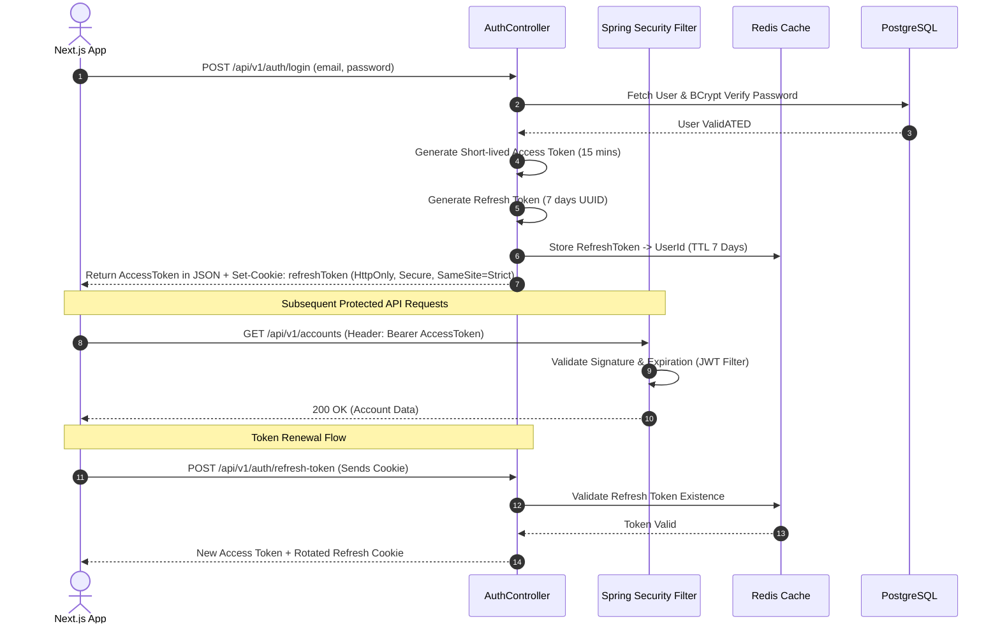

# Security & Transaction Management Specification - Digital Banking Platform

## 18. Authentication Architecture

The platform implements a stateless JWT-based authentication model supplemented by secure HttpOnly cookies for refresh token sliding expiration and Redis-backed session revoking.



---

## 19. Role-Based Access Control (RBAC) Matrix

| Endpoint | Method | `ROLE_CUSTOMER` | `ROLE_EMPLOYEE` | `ROLE_ADMIN` |
|---|---|---|---|---|
| `/api/v1/auth/**` | POST | Anonymous | Anonymous | Anonymous |
| `/api/v1/accounts/me` | GET | Allowed (Own) | Denied | Denied |
| `/api/v1/transfers` | POST | Allowed (Own) | Denied | Denied |
| `/api/v1/savings/**` | GET/POST | Allowed (Own) | Denied | Denied |
| `/api/v1/employee/kyc/**` | GET/PUT | Denied | Allowed | Allowed |
| `/api/v1/admin/users/**` | ALL | Denied | Denied | Allowed |
| `/api/v1/admin/audit-logs` | GET | Denied | Denied | Allowed |

---

## 20. Security Design & OWASP Best Practices

1. **Password Hashing**: BCrypt with strength factor 12. Plaintext passwords never touch logs or persistent storage.
2. **Rate Limiting**: Implemented at the API gateway / Spring Security filter layer backed by Redis sliding window algorithm (Max 100 requests per minute per authenticated IP).
3. **CORS & Headers**:
   - `Access-Control-Allow-Origin`: Explicitly configured to Next.js origin domain (No `*` wildcards allowed).
   - Security Headers: `X-Frame-Options: DENY`, `X-Content-Type-Options: nosniff`, `Strict-Transport-Security: max-age=31536000; includeSubDomains`.
4. **Injection Protection**: Pure JPA/Hibernate parameterized queries. Raw native SQL strings are forbidden.
5. **CSRF Mitigation**: Anti-CSRF double submit cookies required for non-GET browser calls.

---

## 21. Transaction Management & Concurrency Control

### 21.1 Double-Entry Bookkeeping Ledger
Financial transactions follow strictly zero-sum ledger rules: for every transfer of amount $X$, Account A is debited $X$ and Account B is credited $X$.

### 21.2 Pessimistic Locking for Account Transfers
To avoid race conditions and dirty balance updates during high-concurrency transfers on the same account, the system enforces **Pessimistic Write Locking** (`SELECT FOR UPDATE` in PostgreSQL):

```java
// TransferServiceImpl.java Snippet
@Service
@RequiredArgsConstructor
public class TransferServiceImpl implements TransferService {

    private final AccountRepository accountRepository;
    private final TransactionRepository transactionRepository;

    @Override
    @Transactional(isolation = Isolation.READ_COMMITTED, rollbackFor = Exception.class)
    public TransferResponseDto executeTransfer(TransferRequestDto request) {
        
        // Lock accounts in deterministic lexicographical order to prevent database deadlocks
        String firstAccNum = request.getSourceAccountNumber().compareTo(request.getTargetAccountNumber()) < 0 
                ? request.getSourceAccountNumber() : request.getTargetAccountNumber();
        String secondAccNum = firstAccNum.equals(request.getSourceAccountNumber()) 
                ? request.getTargetAccountNumber() : request.getSourceAccountNumber();

        AccountEntity firstAcc = accountRepository.findByAccountNumberWithPessimisticLock(firstAccNum)
                .orElseThrow(() -> new BusinessException(ErrorCode.ACCOUNT_NOT_FOUND));
        AccountEntity secondAcc = accountRepository.findByAccountNumberWithPessimisticLock(secondAccNum)
                .orElseThrow(() -> new BusinessException(ErrorCode.ACCOUNT_NOT_FOUND));

        AccountEntity sourceAcc = firstAcc.getAccountNumber().equals(request.getSourceAccountNumber()) ? firstAcc : secondAcc;
        AccountEntity targetAcc = sourceAcc == firstAcc ? secondAcc : firstAcc;

        // Balance check
        if (sourceAcc.getAvailableBalance().compareTo(request.getAmount()) < 0) {
            throw new BusinessException(ErrorCode.INSUFFICIENT_FUNDS);
        }

        // Ledger mutations
        sourceAcc.setBalance(sourceAcc.getBalance().subtract(request.getAmount()));
        targetAcc.setBalance(targetAcc.getBalance().add(request.getAmount()));

        accountRepository.save(sourceAcc);
        accountRepository.save(targetAcc);

        // Record Transaction Audit Trail
        TransactionEntity tx = TransactionEntity.builder()
                .referenceNumber("TXN-" + UUID.randomUUID().toString().substring(0, 12).toUpperCase())
                .sourceAccount(sourceAcc)
                .targetAccount(targetAcc)
                .amount(request.getAmount())
                .status(TransactionStatus.COMPLETED)
                .build();
                
        return transactionMapper.toResponse(transactionRepository.save(tx));
    }
}
```

---

## 27. Global Exception Handling (RFC 7807)

```java
@RestControllerAdvice
@Slf4j
public class GlobalExceptionHandler extends ResponseEntityExceptionHandler {

    @ExceptionHandler(BusinessException.class)
    public ResponseEntity<ProblemDetail> handleBusinessException(BusinessException ex, HttpServletRequest request) {
        log.warn("Business Exception triggered on [{}]: {}", request.getRequestURI(), ex.getMessage());
        
        ProblemDetail problem = ProblemDetail.forStatusAndDetail(ex.getErrorCode().getHttpStatus(), ex.getMessage());
        problem.setType(URI.create("https://api.digitalbank.com/errors/" + ex.getErrorCode().name()));
        problem.setTitle(ex.getErrorCode().getTitle());
        problem.setProperty("errorCode", ex.getErrorCode().getCode());
        problem.setProperty("timestamp", Instant.now());
        
        return ResponseEntity.status(ex.getErrorCode().getHttpStatus()).body(problem);
    }
}
```
