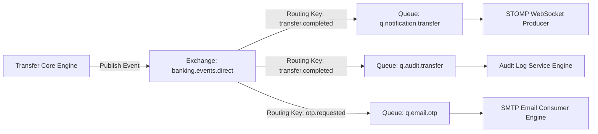

# Infrastructure & DevOps Specification - Digital Banking Platform

## 22. Redis Caching & State Strategy

Redis is utilized for session storage, fast key-value lookup of customer profile metadata, idempotency locking, and rate limiting buckets.

### Cache Eviction & Key Naming Conventions
- **JWT Refresh Tokens**: `auth:refresh:{user_id}` (TTL: 7 Days)
- **OTP Codes**: `auth:otp:{email}` (TTL: 5 Minutes)
- **Account Balance Lookup**: `cache:account:{account_number}` (TTL: 10 Minutes, CacheEvict on Transfer)
- **Idempotency Keys**: `lock:idempotency:{uuid}` (TTL: 24 Hours)

---

## 23. RabbitMQ Asynchronous Messaging Architecture

RabbitMQ manages event decoupling between the transactional core monolith and asynchronous side-effects (sending email receipts, audit compliance logging, push notifications).



---

## 24. WebSocket Real-Time STOMP Engine

- **Endpoint**: `/ws-banking` (SockJS + STOMP protocol)
- **Broker Channel**: `/topic/notifications/{user_id}` for individual customer push updates.
- **Use Cases**: Immediate alert upon receiving money, transfer confirmation popup, high-value transaction warnings.

---

## 25. Background Schedulers

Spring `@Scheduled` cron jobs executed in dedicated worker threads:
1. **Savings Interest Engine** (`0 0 1 * * ?` - Nightly at 1:00 AM): Computes daily accrued interest on active term deposit savings.
2. **Expired OTP Cleanup** (`0 */15 * * * ?` - Every 15 minutes): Purges stale OTP records from Redis/DB.
3. **Daily Statement Compiler** (`0 0 2 1 * ?` - Monthly 1st at 2:00 AM): Generates PDF monthly account statements.

---

## 30. Docker Compose Setup (`docker-compose.yml`)

```yaml
version: '3.8'

services:
  postgres:
    image: postgres:16-alpine
    container_name: bank_postgres
    environment:
      POSTGRES_DB: digital_banking_db
      POSTGRES_USER: bank_admin
      POSTGRES_PASSWORD: BankSuperSecretPassword2026!
    ports:
      - "5432:5432"
    volumes:
      - postgres_data:/var/lib/postgresql/data
    healthcheck:
      test: ["CMD-SHELL", "pg_isready -U bank_admin -d digital_banking_db"]
      interval: 5s
      timeout: 5s
      retries: 5

  redis:
    image: redis:7-alpine
    container_name: bank_redis
    ports:
      - "6379:6379"
    command: redis-server --requirepass RedisSecretPass2026!
    volumes:
      - redis_data:/data

  rabbitmq:
    image: rabbitmq:3.13-management-alpine
    container_name: bank_rabbitmq
    environment:
      RABBITMQ_DEFAULT_USER: bank_mq
      RABBITMQ_DEFAULT_PASS: MQSecretPass2026!
    ports:
      - "5672:5672"
      - "15672:15672"

  backend:
    build:
      context: ./backend
      dockerfile: Dockerfile
    container_name: bank_backend_api
    environment:
      SPRING_PROFILES_ACTIVE: prod
      SPRING_DATASOURCE_URL: jdbc:postgresql://postgres:5432/digital_banking_db
      SPRING_DATASOURCE_USERNAME: bank_admin
      SPRING_DATASOURCE_PASSWORD: BankSuperSecretPassword2026!
      SPRING_REDIS_HOST: redis
      SPRING_REDIS_PORT: 6379
      SPRING_REDIS_PASSWORD: RedisSecretPass2026!
      SPRING_RABBITMQ_HOST: rabbitmq
    ports:
      - "8080:8080"
    depends_on:
      postgres:
        condition: service_healthy

volumes:
  postgres_data:
  redis_data:
```

---

## 33. GitHub Actions CI/CD Pipeline

```yaml
name: Banking Platform CI/CD Pipeline

on:
  push:
    branches: [ main, develop ]
  pull_request:
    branches: [ main ]

jobs:
  backend-build-test:
    runs-on: ubuntu-latest
    steps:
      - uses: actions/checkout@v4
      - name: Set up JDK 21
        uses: actions/setup-java@v4
        with:
          java-version: '21'
          distribution: 'temurin'
          cache: maven
      - name: Build with Maven & Run Unit/Integration Tests
        run: mvn clean verify -Dspring.profiles.active=test
      - name: Build Docker Image
        run: docker build -t digital-banking-backend:latest ./backend

  frontend-build-test:
    runs-on: ubuntu-latest
    steps:
      - uses: actions/checkout@v4
      - name: Set up Node.js 20
        uses: actions/setup-node@v4
        with:
          node-version: 20
          cache: 'npm'
      - name: Install dependencies & Build Next.js
        run: |
          cd frontend
          npm ci
          npm run build
```
