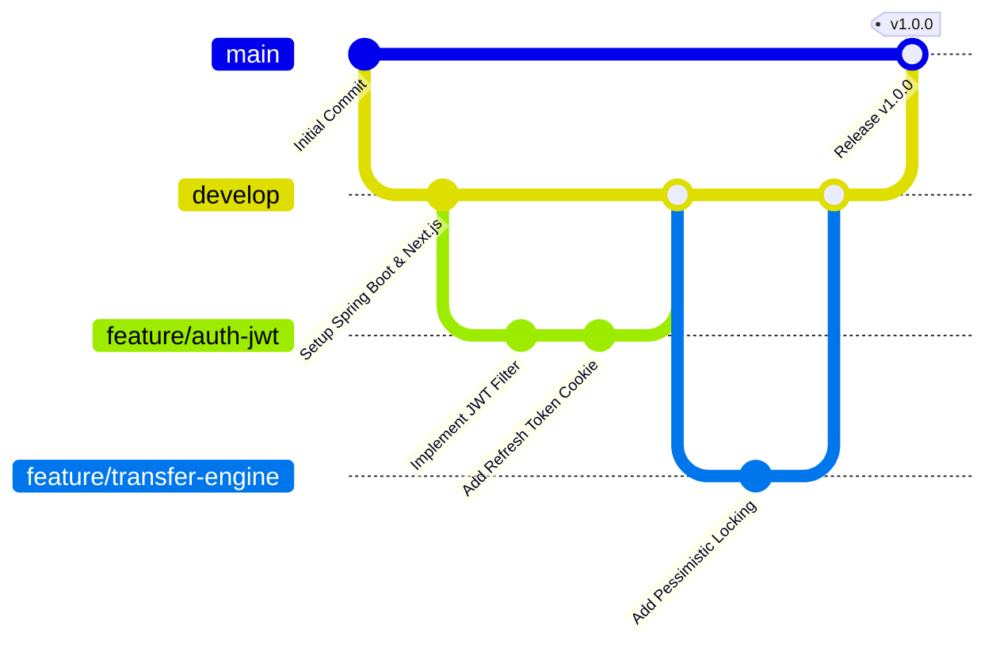

# Testing Strategy, Development Roadmap & Coding Standards

## 32. Testing Strategy & Testcontainers Integration

### 32.1 Testing Pyramid
- **Unit Testing (JUnit 5 + Mockito)**: Target 85%+ code coverage for business logic services, validators, and domain entities.
- **Integration Testing (Testcontainers + PostgreSQL/Redis)**: Spins up actual PostgreSQL 16 and Redis 7 Docker containers during build validation to test SQL queries, constraints, and concurrency locks accurately.
- **End-to-End Testing (Playwright)**: Full browser automation tests for authentication flow, transfer execution, and OTP modal entry.

### 32.2 Integration Test Code Sample with Testcontainers

```java
@SpringBootTest(webEnvironment = SpringBootTest.WebEnvironment.RANDOM_PORT)
@Testcontainers
@ActiveProfiles("test")
class TransferIntegrationTest {

    @Container
    static PostgreSQLContainer<?> postgres = new PostgreSQLContainer<>("postgres:16-alpine")
            .withDatabaseName("test_banking_db")
            .withUsername("test")
            .withPassword("test");

    @DynamicPropertySource
    static void configureProperties(DynamicPropertyRegistry registry) {
        registry.add("spring.datasource.url", postgres::getJdbcUrl);
        registry.add("spring.datasource.username", postgres::getUsername);
        registry.add("spring.datasource.password", postgres::getPassword);
    }

    @Autowired
    private TransferService transferService;

    @Autowired
    private AccountRepository accountRepository;

    @Test
    @DisplayName("Should execute transfer successfully and maintain accurate balances")
    void testExecuteTransferSuccess() {
        // Test logic asserting balance changes and ledger entries...
    }
}
```

---

## 34. 12-Week Implementation Roadmap & Sequential Chapter Guide

### 34.1 Weekly Milestone Summary
| Phase | Weeks | Target Milestones & Deliverables |
|---|---|---|
| **Phase 1: Architecture & Foundation** | Week 1–2 | Project scaffolding (Spring Boot 3 + Next.js 15), Flyway schema migration `V1`, PostgreSQL & Redis setup, Docker Compose base setup. |
| **Phase 2: Core Auth & Customer KYC** | Week 3–4 | Spring Security 6 JWT + HttpOnly Cookie flow, BCrypt user registration, Email OTP verification, Profile management. |
| **Phase 3: Multi-Account & Ledger Core** | Week 5–6 | Account creation logic, balance queries, optimistic/pessimistic locking mechanisms, Flyway `V2` schema additions. |
| **Phase 4: Money Transfer & Transactions** | Week 7–8 | Internal transfers engine, `@Transactional` boundaries, Idempotency filter, OTP verification trigger ($1k+ limit), Audit logging. |
| **Phase 5: Savings & Background Engine** | Week 9 | Term deposit opening/closing, Spring `@Scheduled` interest calculation cron, Redis balance invalidation. |
| **Phase 6: WebSockets & Admin Dashboard** | Week 10 | STOMP real-time notification engine, Admin audit console, User blocking/unlocking, System limits configuration. |
| **Phase 7: Testing & Security Hardening** | Week 11 | Testcontainers integration tests setup, OWASP security headers check, Rate limiting validation, Playwright E2E suite. |
| **Phase 8: CI/CD & Final Production Polish** | Week 12 | GitHub Actions automated pipelines, Docker multi-stage optimization, Swagger OpenAPI generation, Portfolio documentation. |

### 34.2 Sequential Chapter-by-Chapter Execution Map (Chương 1 ➡️ Chương 36)

| Phase | Chapter Range | Chapter Title | Core Developer Action / Implementation Step |
|---|---|---|---|
| **Phase 1** | **Chương 1 – 9** | Business Requirements & Rules | Read & study domain rules, account limits, OTP thresholds & Mermaid flowcharts. |
| **Phase 2** | **Chương 10, 14 – 15** | System & Package Architecture | Scaffolding Spring Boot 3 (Package-by-Feature) & Next.js 15 App Router directory tree. |
| **Phase 2** | **Chương 11 – 12** | Database & Flyway Migrations | Create PostgreSQL ERD tables via Flyway script `V1__init_schema.sql`. |
| **Phase 2** | **Chương 16 – 17** | Layered Lifecycle & Frontend State | Setup `Controller -> Service -> Repo -> DTO` mapping & TanStack Query/Axios interceptors. |
| **Phase 3** | **Chương 13, 18 – 20** | Authentication, RBAC & Security | Implement Spring Security 6 JWT, HttpOnly Cookie, BCrypt, Rate Limiter & `@PreAuthorize`. |
| **Phase 3** | **Chương 21, 27 – 28** | Transfer Ledger & Exception Handling | Code `@Transactional` internal transfer, Pessimistic Lock (`SELECT FOR UPDATE`), Idempotency & RFC 7807 handler. |
| **Phase 4** | **Chương 22 – 26** | Redis, RabbitMQ & WebSockets | Implement Redis Session/Cache, RabbitMQ async email worker, STOMP WebSocket push & Cron interest scheduler. |
| **Phase 4** | **Chương 29 – 31** | Docker & Infrastructure | Write Dockerfile Multi-stage build, `.env` file & run `docker-compose up -d`. |
| **Phase 5** | **Chương 32 – 35** | Testing, CI/CD & Coding Standards | Write Unit Tests (JUnit 5), Integration Tests (Testcontainers), GitHub Actions & GitFlow strategy. |
| **Phase 6** | **Chương 36** | 100 Interview Questions | Review 100 senior banking backend interview questions to prepare for job applications. |


---

## 35. Enterprise Coding Standards & Git Branch Strategy

### 35.1 Coding Conventions
- **Immutability**: Prefer Java 21 `record` types for DTOs and value objects. Use `@Value` / `final` fields wherever applicable.
- **Lombok**: Use `@Getter`, `@RequiredArgsConstructor`, `@Builder` selectively; avoid `@Data` on JPA entities to prevent cyclic `equals`/`hashCode` memory leaks.
- **REST Paths**: Naming in plural nouns (e.g., `/api/v1/accounts`, `/api/v1/transfers`). Never use verbs in REST paths.
- **Commit Messages**: Follow Conventional Commits convention:
  - `feat(transfer): add idempotency key verification header`
  - `fix(auth): fix refresh token expiration check in redis`
  - `docs(api): update openapi schema for account creation`

### 35.2 Git Branch Strategy (GitFlow)


