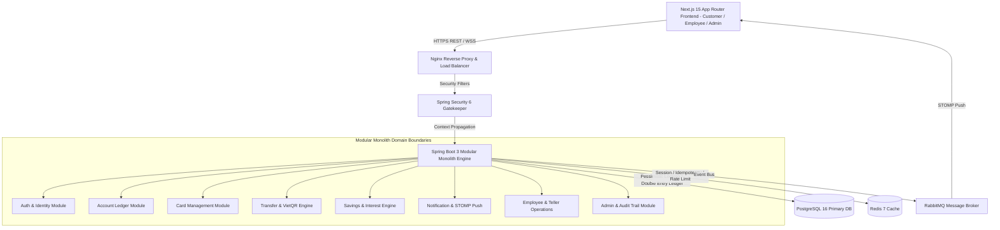
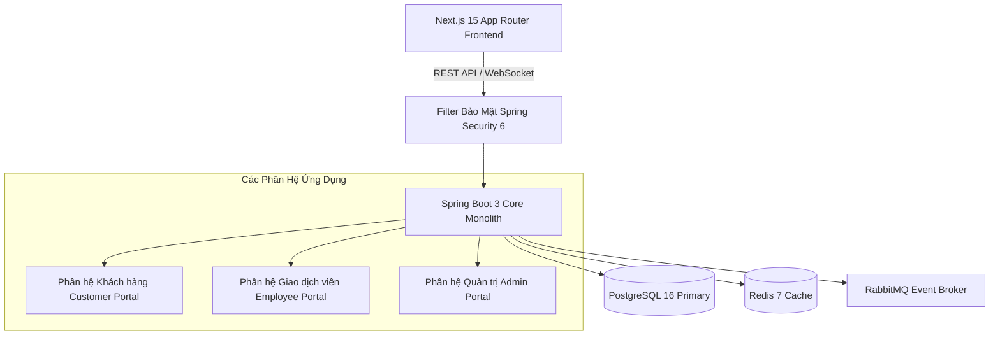
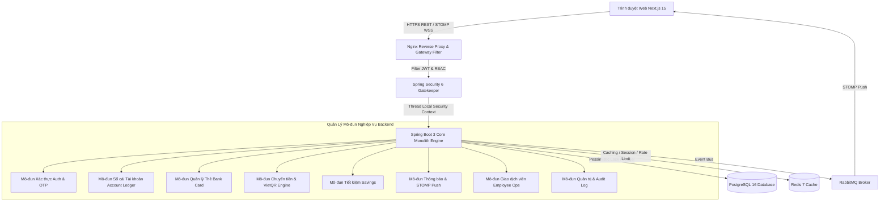
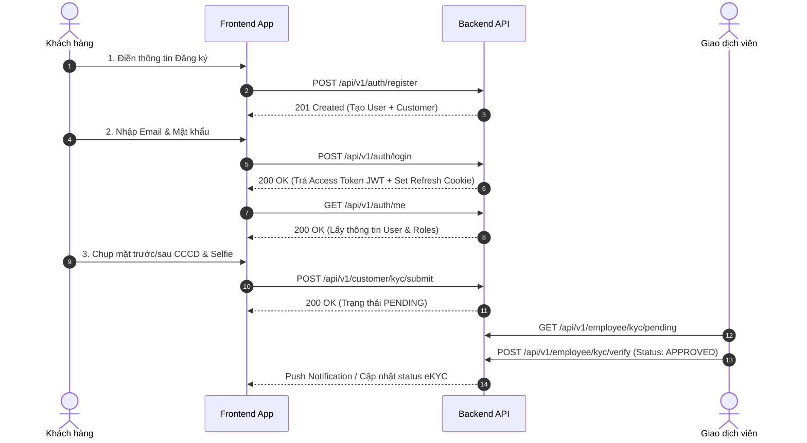
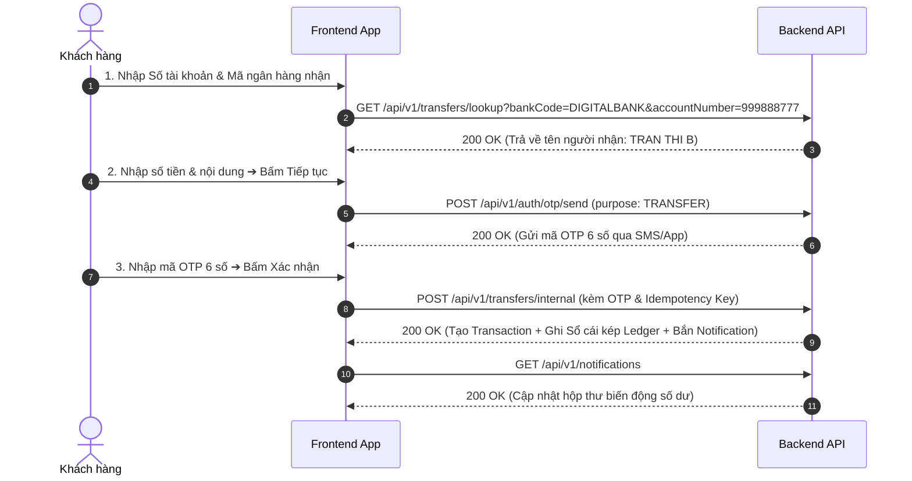
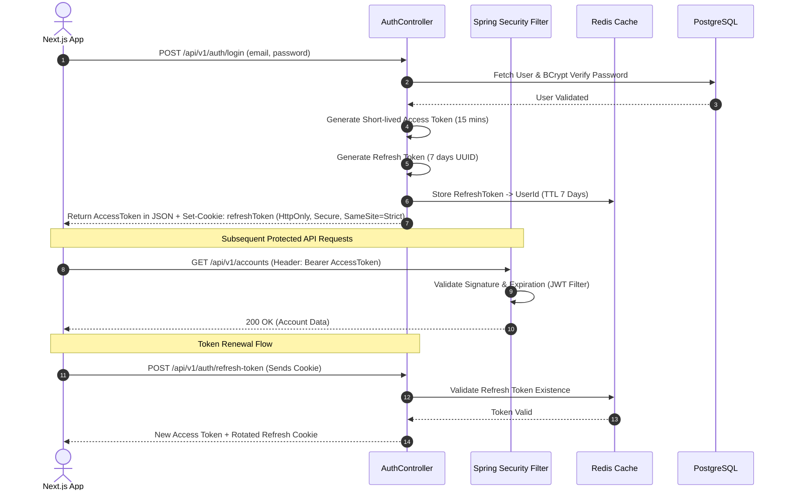
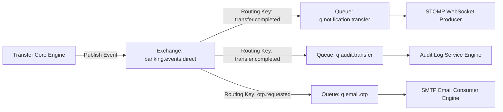
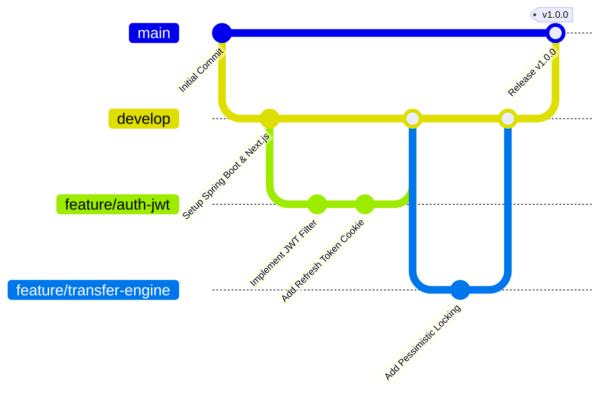

# Nền Tảng Ngân Hàng Số Enterprise (Digital Banking Platform) - Master Specification & Architectural Blueprint

> **Phiên bản tài liệu**: 3.0.0 (**MASTER COMPREHENSIVE DOCUMENTATION**)  
> **Trạng thái**: Production-Ready Enterprise Architecture & Specification Blueprint  
> **Hệ sinh thái công nghệ**:  
> - **Backend Core**: Java 21 LTS, Spring Boot 3.3+, Spring Security 6, Spring Data JPA, Hibernate ORM, Flyway Migration.  
> - **Database & Cache**: PostgreSQL 16 (Native JSONB, Pessimistic Locking), Redis 7 (Session, Cache, Rate Limiting).  
> - **Messaging & Real-time**: RabbitMQ (Event-Driven Broker), WebSocket STOMP (SockJS Real-time Push).  
> - **Frontend Stack**: Next.js 15 (App Router with React 19), TypeScript, Tailwind CSS, TanStack Query v5, Axios.  
> - **DevOps & Infra**: Docker Compose, GitHub Actions CI/CD, Testcontainers, Maven.

---

## 📚 Mục Lục Toàn Cầu (Table of Contents)

- [Phần I: Tổng Quan Dự Án & Phạm Vi Hệ Thống](#phần-i-tổng-quan-dự-án--phạm-vi-hệ-thống)
- [Phần II: Tài Liệu Yêu Cầu Nghiệp Vụ (BRD - Business Requirements)](#phần-ii-tài-liệu-yêu-cầu-nghiệp-vụ-brd---business-requirements)
- [Phần III: Kiến Trúc Hệ Thống & Cấu Trúc Mã Nguồn](#phần-iii-kiến-trúc-hệ-thống--cấu-trúc-mã-nguồn)
- [Phần IV: Thiết Kế Cơ Sở Dữ Liệu PostgreSQL 16 (ERD & Schema)](#phần-iv-thiết-kế-cơ-sở-dữ-liệu-postgresql-16-erd--schema)
- [Phần V: Đặc Tả REST API Specification (50+ Endpoints & Flows)](#phần-v-đặc-tả-rest-api-specification-50-endpoints--flows)
- [Phần VI: Bảo Mật, Quản Lý Giao Dịch & Xử Lý Ngoại Lệ](#phần-vi-bảo-mật-quản-lý-giao-dịch--xử-lý-ngoại-lệ)
- [Phần VII: Hạ Tầng Phân Tán, Messaging & DevOps](#phần-vii-hạ-tầng-phân-tán-messaging--devops)
- [Phần VIII: Chiến Lược Kiểm Thử, Lộ Trình Triển Khai & Code Standard](#phần-viii-chiến-lược-kiểm-thử-lộ-trình-triển-khai--code-standard)
- [Phần IX: Next.js 15 Frontend Prompt Engineering Guide](#phần-ix-nextjs-15-frontend-prompt-engineering-guide)
- [Phần X: Ngân Hàng Kiến Thức & Câu Hỏi Chuyên Sâu Banking Java](#phần-x-ngân-hàng-kiến-thức--câu-hỏi-chuyên-sâu-banking-java)

---

## Phần I: Tổng Quan Dự Án & Phạm Vi Hệ Thống

### 1.1 Executive Summary

Nền tảng **Digital Banking Platform** là giải pháp ngân hàng số đa kênh (Omnichannel Banking) cấp Doanh nghiệp, được thiết kế để cung cấp các dịch vụ tài chính an toàn, sẵn sàng cao và không rào cản cho cả khách hàng cá nhân (Customer), nhân viên giao dịch tại quầy (Teller) và quản trị viên hệ thống (Admin).

#### Điểm Nổi Bật Về Kiến Trúc & Công Nghệ
- **Kiến trúc**: Modular Monolith tách biệt theo các Domain nghiệp vụ rõ ràng, dễ bảo trì và sẵn sàng chuyển đổi sang Microservices khi mở rộng quy mô.
- **Backend Stack**: Java 21 LTS (Virtual Threads), Spring Boot 3.3+, Spring Security 6, PostgreSQL 16, Redis 7, RabbitMQ, STOMP WebSockets.
- **Frontend Stack**: Next.js 15 (App Router), React 19, TypeScript, Tailwind CSS, TanStack Query v5, Lucide Icons.
- **Mục tiêu cốt lõi**: Xử lý giao dịch tài chính tốc độ cao với thời gian phản hồi sub-second ($< 200\text{ms}$ cho read API, $< 500\text{ms}$ cho write transfer), đảm bảo tính toàn vẹn dữ liệu tuyệt đối (ACID) và tuân thủ các quy chuẩn bảo mật ngân hàng OWASP & ISO 27001.

---

### 1.2 Biểu Đồ Architecture Tổng Thể Hệ Thống



---

### 1.3 Bản Đồ Triển Khai 24 Màn Hình Hệ Thống

Hệ thống mã nguồn Frontend (`frontend/src/app`) bao gồm 24 màn hình chính được chia thành 3 phân hệ độc lập:

#### 1. Phân hệ Khách hàng (Customer Portal)
- `/login` - Đăng nhập tài khoản
- `/register` - Đăng ký trực tuyến
- `/(dashboard)/dashboard` - Trang chủ tổng quan & số dư
- `/(dashboard)/cards` - Quản lý Thẻ ngân hàng (Debit/Credit/Virtual, Khóa thẻ, Đổi PIN, Hạn mức)
- `/(dashboard)/qr-pay` - Thanh toán VietQR NAPAS 247 & Quét mã QR
- `/(dashboard)/notifications` - Trung tâm Thông báo biến động số dư & Cảnh báo bảo mật
- `/(dashboard)/accounts` - Quản lý tài khoản thanh toán & sao kê
- `/(dashboard)/transfers` - Chuyển tiền nội bộ & liên ngân hàng 24/7
- `/(dashboard)/savings` - Gửi tiết kiệm online & tất toán
- `/(dashboard)/bills` - Thanh toán hóa đơn & nạp tiền điện thoại
- `/(dashboard)/beneficiaries` - Danh bạ người thụ hưởng
- `/(dashboard)/transactions` - Lịch sử giao dịch & Tải sao kê PDF/Excel
- `/(dashboard)/settings` & `/change-password` - Cài đặt cá nhân & Đổi mật khẩu

#### 2. Phân hệ Nhân viên Ngân hàng (Teller / Employee Portal)
- `/employee/dashboard` - Dashboard giao dịch viên
- `/employee/customers` - Tra cứu hồ sơ khách hàng
- `/employee/accounts` - Mở & Khóa/Mở khóa tài khoản tại quầy
- `/employee/kyc` - Phê duyệt hồ sơ định danh eKYC Level 2
- `/employee/cash-ops` - Giao dịch Nộp / Rút tiền mặt tại quầy
- `/employee/transactions` - Tra cứu & Soát xét giao dịch toàn hệ thống

#### 3. Phân hệ Quản trị Hệ thống (Admin Portal)
- `/admin/dashboard` - Dashboard phân tích sức khỏe hệ thống
- `/admin/users` - Quản lý nhân viên nội bộ & phân vai trò
- `/admin/roles` - Quản lý phân quyền RBAC
- `/admin/audit` - Nhật ký hệ thống Audit Logs (Vết thao tác)
- `/admin/system` - Cấu hình tham số & Feature Toggles

---

## Phần II: Tài Liệu Yêu Cầu Nghiệp Vụ (BRD - Business Requirements)

### 2.1 Sơ Đồ Phân Hệ Ứng Dụng



---

### 2.2 Danh Mục Yêu Cầu Chức Năng Chi Tiết (Functional Requirements)

#### A. Phân Hệ Khách Hàng (Customer Portal)

| Mã Yêu Cầu | Module | Tên Tính Năng | Mô Tả Nghiệp Vụ Chi Tiết | Mức Độ Ưu Tiên |
|---|---|---|---|---|
| **FR-AUTH-01** | Auth | Đăng ký trực tuyến | Cho phép khách hàng mở tài khoản mới với Email, SĐT, Họ tên và CCCD. | Cao |
| **FR-AUTH-02** | Auth | Đăng nhập đa yếu tố | Xác thực đăng nhập bằng JWT, HttpOnly Cookie và mã OTP cho thiết bị mới. | Cao |
| **FR-DASH-01** | Dashboard | Tổng quan tài khoản | Xem tổng số dư, danh sách tài khoản, biểu đồ dòng tiền thu/chi và lối tắt giao dịch. | Cao |
| **FR-CARD-01** | Cards | Quản lý Thẻ ngân hàng | Danh sách thẻ Debit/Credit/Virtual; **Khóa/mở khóa thẻ khẩn cấp**; **Đổi mã PIN 6 số**; Cấu hình hạn mức Online/ATM/POS. | **Cao (Ưu tiên 1)** |
| **FR-CARD-02** | Cards | Phát hành Thẻ ảo | Đăng ký phát hành thẻ phi vật lý Visa Virtual lấy ngay trong 30 giây. | **Cao (Ưu tiên 1)** |
| **FR-QR-01** | VietQR | Tạo mã VietQR nhận tiền | Tạo mã QR chuẩn **NAPAS 247** động/tĩnh đính kèm số tài khoản, số tiền & nội dung chuyển. | **Cao (Ưu tiên 1)** |
| **FR-QR-02** | VietQR | Quét mã QR chuyển tiền | Quét camera hoặc tải ảnh QR để bóc tách ngân hàng nhận, STK, tên người nhận và số tiền. | **Cao (Ưu tiên 1)** |
| **FR-NOTIF-01** | Notifications | Trung tâm Thông báo | Theo dõi thông báo biến động số dư (+/-), cảnh báo bảo mật, ưu đãi & bảo trì hệ thống. | **Cao (Ưu tiên 1)** |
| **FR-ACC-01** | Accounts | Quản lý Tài khoản | Tra cứu danh sách tài khoản thanh toán, số dư khả dụng/phong tỏa & tải sao kê chi tiết. | Cao |
| **FR-TRF-01** | Transfers | Chuyển tiền 24/7 | Chuyển tiền nội bộ & liên ngân hàng nhanh 24/7 với xác thực OTP và tự động tra cứu tên. | Cao |
| **FR-SAV-01** | Savings | Tiết kiệm trực tuyến | Mở sổ tiết kiệm online, tính toán dự tính lãi suất, quản lý danh sách sổ & tất toán. | Cao |
| **FR-BILL-01** | Bills | Thanh toán Hóa đơn | Thanh toán hóa đơn Điện, Nước, Internet, Truyền hình và Nạp tiền điện thoại (Top-up). | Trung bình |
| **FR-BEN-01** | Beneficiaries | Danh bạ thụ hưởng | Lưu danh sách người nhận tiền thường xuyên, thêm/sửa/xóa liên hệ nhanh. | Trung bình |
| **FR-TX-01** | Transactions | Lịch sử & Sao kê | Tìm kiếm & lọc lịch sử giao dịch nâng cao, xuất báo cáo sao kê dạng PDF hoặc Excel. | Cao |

#### B. Phân Hệ Nhân Viên Ngân Hàng (Bank Employee / Teller Portal)

| Mã Yêu Cầu | Module | Tên Tính Năng | Mô Tả Nghiệp Vụ Chi Tiết | Mức Độ Ưu Tiên |
|---|---|---|---|---|
| **FR-EMP-01** | Dashboard | Dashboard GDV | Thống kê chỉ số làm việc trong ngày của Giao dịch viên (số hồ sơ KYC, tiền nộp/rút). | Cao |
| **FR-EMP-02** | Customers | Tra cứu Khách hàng | Tìm kiếm thông tin khách hàng theo CCCD, Số điện thoại hoặc Số tài khoản. | Cao |
| **FR-EMP-03** | Accounts | Mở & Khóa tài khoản | Mở tài khoản thanh toán mới tại quầy hoặc thực hiện khóa/mở khóa tài khoản khi có sự cố. | Cao |
| **FR-EMP-04** | eKYC | Duyệt hồ sơ eKYC | Đánh giá & Phê duyệt/Từ chối hồ sơ định danh cá nhân eKYC Level 2 dựa trên ảnh CCCD & Selfie. | Cao |
| **FR-EMP-05** | Cash Ops | Giao dịch Tiền mặt | Thực hiện nghiệp vụ Nộp tiền mặt (Cash Deposit) & Rút tiền mặt (Cash Withdrawal) tại quầy. | Cao |
| **FR-EMP-06** | Audit Tx | Tra cứu Soát xét | Kiểm tra & soát xét lịch sử giao dịch lỗi toàn hệ thống. | Cao |

#### C. Phân Hệ Quản Trị Hệ Thống (Admin Portal)

| Mã Yêu Cầu | Module | Tên Tính Năng | Mô Tả Nghiệp Vụ Chi Tiết | Mức Độ Ưu Tiên |
|---|---|---|---|---|
| **FR-ADM-01** | Dashboard | Thống kê Quản trị | Biểu đồ theo dõi sức khỏe hệ thống, tổng tài sản CASA, lượng giao dịch thời gian thực. | Cao |
| **FR-ADM-02** | Users | Quản lý Nhân viên | Quản lý danh sách tài khoản nội bộ, tạo tài khoản cho Giao dịch viên/Kiểm soát viên. | Cao |
| **FR-ADM-03** | Roles | Phân quyền RBAC | Quản lý vai trò (Roles) và ma trận phân quyền chi tiết (Permissions). | Cao |
| **FR-ADM-04** | Audit Logs | Nhật ký Truy vết | Tra cứu nhật ký vết thao tác (Audit Trail) của toàn bộ người dùng và nhân viên. | Cao |
| **FR-ADM-05** | System | Cấu hình Hệ thống | Điều chỉnh hạn mức mặc định, phí giao dịch, bảo trì & bật/tắt tính năng (Feature Toggles). | Cao |

---

### 2.3 Yêu Cầu Phi Chức Năng (Non-Functional Requirements)

1. **Hiệu năng (Performance)**:
   - Latency cho thao tác đọc (Read APIs): $< 200\text{ms}$.
   - Latency cho thao tác ghi giao dịch (Write Transfer APIs): $< 500\text{ms}$.
   - Khả năng chịu tải đồng thời: $10,000$ active users đồng thời.
2. **Tính sẵn sàng (Availability)**: Đạt chuẩn Uptime $99.99\%$ (Downtime không quá 52 phút/năm).
3. **Tính Toàn Vẹn Dữ Liệu (ACID)**: Áp dụng cơ chế Pessimistic Locking và Sổ cái kép (Double-Entry Ledger) để đảm bảo không mất mát hay sai lệch số dư.
4. **Bảo mật (Security)**: Tuân thủ OWASP Top 10, mã hóa dữ liệu nhạy cảm AES-256, giao tiếp mã hóa TLS 1.3.

---

## Phần III: Kiến Trúc Hệ Thống & Cấu Trúc Mã Nguồn

### 3.1 Mô Hình Modular Monolith & Execution Engine



---

### 3.2 Cấu Trúc Thư Mục Frontend (Next.js 15 App Router)

Mã nguồn Frontend nằm tại thư mục `frontend/src` và được tổ chức theo chuẩn Next.js 15 App Router:

```text
frontend/src/
├── app/
│   ├── (dashboard)/            # Phân hệ Khách hàng (Customer Portal)
│   │   ├── accounts/           # Trang Quản lý tài khoản thanh toán & sao kê
│   │   ├── beneficiaries/      # Trang Danh bạ người thụ hưởng
│   │   ├── bills/              # Trang Thanh toán hóa đơn & nạp tiền điện thoại
│   │   ├── cards/              # Trang Quản lý Thẻ (Debit/Credit/Virtual, Khóa thẻ, Đổi PIN)
│   │   ├── dashboard/          # Trang Chủ tổng quan tài khoản & biểu đồ dòng tiền
│   │   ├── notifications/      # Trang Trung tâm Thông báo biến động số dư & bảo mật
│   │   ├── qr-pay/             # Trang Thanh toán VietQR NAPAS 247 & Quét mã QR
│   │   ├── savings/            # Trang Gửi tiết kiệm online & tất toán
│   │   ├── settings/           # Trang Cài đặt cá nhân & đổi mật khẩu
│   │   ├── transactions/       # Trang Lịch sử giao dịch & xuất sao kê PDF/Excel
│   │   └── transfers/          # Trang Chuyển tiền nội bộ & liên ngân hàng 24/7
│   ├── admin/                  # Phân hệ Quản trị (Admin Portal)
│   │   ├── audit/              # Trang Nhật ký vết thao tác (Audit Logs)
│   │   ├── dashboard/          # Trang Dashboard thống kê sức khỏe hệ thống
│   │   ├── roles/              # Trang Quản lý phân quyền RBAC
│   │   ├── system/             # Trang Cấu hình hệ thống & Feature Toggles
│   │   └── users/              # Trang Quản lý nhân viên nội bộ
│   ├── employee/               # Phân hệ Giao dịch viên (Teller Portal)
│   │   ├── accounts/           # Trang Mở & Khóa tài khoản tại quầy
│   │   ├── cash-ops/           # Trang Giao dịch Nộp / Rút tiền mặt tại quầy
│   │   ├── customers/          # Trang Tra cứu hồ sơ khách hàng
│   │   ├── dashboard/          # Trang Dashboard giao dịch viên
│   │   ├── kyc/                # Trang Phê duyệt hồ sơ định danh eKYC
│   │   └── transactions/       # Trang Tra cứu & Soát xét giao dịch
│   ├── login/                  # Trang Đăng nhập
│   ├── register/               # Trang Đăng ký trực tuyến
│   ├── globals.css             # Stylesheet toàn cục với Tailwind CSS
│   └── layout.tsx              # Root Layout toàn ứng dụng
├── components/                 # Các UI Components tái sử dụng
│   ├── admin/                  # Components giao dịch Admin (AdminSidebar...)
│   ├── employee/               # Components giao dịch Employee (EmployeeSidebar...)
│   ├── layout/                 # Layout chính (Sidebar, Header...)
│   └── ui/                     # UI Primitives (Button, Modal, Card...)
├── lib/
│   ├── api/                    # Axios API Client instances & Services
│   ├── mock/                   # Dữ liệu giả lập (cardsData, notificationsData...)
│   └── types/                  # TypeScript Types & Interfaces (cards, notifications, admin...)
└── providers/                  # React Context & TanStack Query Providers
```

---

### 3.3 Quản Lý Trạng Thái & Tích Hợp API (Frontend Strategy)

1. **Server State (TanStack Query v5)**: Quản lý việc fetch, cache và revalidate dữ liệu từ backend (tài khoản, danh sách thẻ, thông báo, nhật ký giao dịch).
2. **Local Component State**: Quản lý trạng thái UI ngắn hạn (mở/đóng Modal đổi PIN, chuyển đổi giữa các thẻ, chọn tab quét/tạo mã QR).
3. **Optimistic Updates**: Khi thực hiện khóa/mở khóa thẻ hoặc đánh dấu đã đọc thông báo, UI cập nhật ngay lập tức trước khi nhận phản hồi từ server để tăng độ mượt mà.

---

## Phần IV: Thiết Kế Cơ Sở Dữ Liệu PostgreSQL 16 (ERD & Schema)

> **Phiên bản Schema**: 2.3.0 (**FROZEN - Production Ready**)  
> **Hệ quản trị CSDL**: PostgreSQL 16 (JSONB & Native Enum Support)  
> **Quản lý Migration**: Flyway SQL Migration Scripts

---

### 4.1 Sơ Đồ ERD Cơ Sở Dữ Liệu Tổng Thể (20 Thực Thể)

```mermaid
erDiagram
    USERS ||--o| CUSTOMERS : "1-1 Hồ sơ khách hàng"
    USERS ||--o| EMPLOYEES : "1-1 Hồ sơ nhân viên"
    USERS ||--o{ REFRESH_TOKENS : "quản lý phiên JWT"
    USERS ||--o{ OTP_CODES : "quản lý mã OTP"
    USERS ||--o{ USER_ROLES : "gán vai trò"
    
    ROLES ||--o{ USER_ROLES : "chứa người dùng"
    ROLES ||--o{ ROLE_PERMISSIONS : "chứa quyền hạn"
    PERMISSIONS ||--o{ ROLE_PERMISSIONS : "thuộc vai trò"

    BRANCHES ||--o{ EMPLOYEES : "quản lý nhân viên chi nhánh"
    CUSTOMERS ||--o{ ACCOUNTS : "sở hữu tài khoản"
    CUSTOMERS ||--o{ BENEFICIARIES : "lưu sổ địa chỉ thụ hưởng"
    CUSTOMERS ||--o{ NOTIFICATIONS : "nhận thông báo"
    CUSTOMERS ||--o{ KYC_DOCUMENTS : "nộp eKYC"

    ACCOUNTS ||--o{ CARDS : "liên kết phát hành thẻ"
    ACCOUNTS ||--o{ SAVINGS_ACCOUNTS : "nguồn tiền tiết kiệm"
    ACCOUNTS ||--o{ TRANSACTIONS : "tài khoản nguồn/đích"
    ACCOUNTS ||--o{ CASH_TRANSACTIONS : "giao dịch tại quầy"

    CARDS ||--o{ CARD_TRANSACTIONS : "giao dịch quẹt thẻ/POS"
    TRANSACTIONS ||--o{ LEDGER_ENTRIES : "ghi sổ cái kép"
    EMPLOYEES ||--o{ KYC_DOCUMENTS : "phê duyệt eKYC"
    EMPLOYEES ||--o{ CASH_TRANSACTIONS : "thực hiện giao dịch tại quầy"
    USERS ||--o{ SYSTEM_CONFIGS : "quản trị chỉnh sửa tham số"

    USERS {
        uuid id PK
        string email UK
        string phone_number UK
        string password_hash
        string status
        timestamp created_at
        timestamp updated_at
    }

    CUSTOMERS {
        uuid id PK
        uuid user_id FK_UK
        string customer_code UK
        string full_name
        string national_id UK
        date date_of_birth
        string address
        string avatar_url
        timestamp created_at
        timestamp updated_at
    }

    BRANCHES {
        uuid id PK
        string branch_code UK
        string branch_name
        string address
        string city
        string phone_number
        timestamp created_at
    }

    EMPLOYEES {
        uuid id PK
        uuid user_id FK_UK
        string employee_code UK
        string full_name
        uuid branch_id FK
        string department
        date hire_date
        timestamp created_at
        timestamp updated_at
    }

    REFRESH_TOKENS {
        uuid id PK
        uuid user_id FK
        string token_hash UK
        string device_info
        string ip_address
        boolean is_revoked
        timestamp last_used_at
        timestamp expires_at
        timestamp created_at
    }

    OTP_CODES {
        uuid id PK
        uuid user_id FK
        string purpose
        string code_hash
        integer attempt_count
        integer max_attempts
        boolean is_used
        timestamp expires_at
        timestamp created_at
    }

    ROLES {
        uuid id PK
        string role_code UK
        string role_name
    }

    PERMISSIONS {
        uuid id PK
        string permission_code UK
        string permission_name
    }

    USER_ROLES {
        uuid user_id FK
        uuid role_id FK
    }

    ROLE_PERMISSIONS {
        uuid role_id FK
        uuid permission_id FK
    }

    ACCOUNTS {
        uuid id PK
        string account_number UK
        uuid customer_id FK
        decimal balance
        decimal frozen_balance
        decimal available_balance
        string currency
        string account_type
        string status
        timestamp opened_at
        timestamp closed_at
        timestamp created_at
        timestamp updated_at
    }

    CARDS {
        uuid id PK
        string card_number_encrypted UK
        string masked_number
        uuid linked_account_id FK
        string card_type
        string network
        string status
        integer expiry_month
        integer expiry_year
        string cvv_hash
        string pin_hash
        boolean is_online_enabled
        boolean is_international_enabled
        decimal daily_online_limit
        decimal daily_atm_limit
        decimal daily_pos_limit
        timestamp created_at
        timestamp updated_at
    }

    CARD_TRANSACTIONS {
        uuid id PK
        uuid card_id FK
        string merchant_name
        string merchant_category
        decimal amount
        string currency
        string status
        timestamp transaction_time
    }

    TRANSACTIONS {
        uuid id PK
        string transaction_code UK
        uuid source_account_id FK
        uuid target_account_id FK
        string target_bank_code
        string target_bank_name
        string target_account_number
        string target_account_name
        decimal amount
        decimal fee_amount
        string description
        string transaction_type
        string status
        string idempotency_key UK
        timestamp completed_at
        timestamp created_at
    }

    LEDGER_ENTRIES {
        uuid id PK
        uuid transaction_id FK
        uuid account_id FK
        string entry_type
        decimal amount
        decimal balance_after
        string description
        bigint sequence_number
        timestamp entry_time
    }

    SAVINGS_ACCOUNTS {
        uuid id PK
        string savings_code UK
        uuid customer_id FK
        uuid source_account_id FK
        decimal principal_amount
        decimal interest_rate
        integer term_months
        decimal expected_interest
        string auto_renewal_option
        string status
        timestamp start_date
        timestamp maturity_date
        timestamp created_at
        timestamp updated_at
    }

    BENEFICIARIES {
        uuid id PK
        uuid customer_id FK
        string beneficiary_name
        string account_number
        string bank_code
        string alias_name
        timestamp created_at
        timestamp updated_at
    }

    NOTIFICATIONS {
        uuid id PK
        uuid customer_id FK
        string title
        string message
        string notification_type
        string reference_type
        string reference_id
        boolean is_read
        timestamp created_at
    }

    KYC_DOCUMENTS {
        uuid id PK
        uuid customer_id FK
        string front_id_card_url
        string back_id_card_url
        string selfie_photo_url
        string status
        uuid verified_by_employee_id FK
        string rejection_reason
        timestamp submitted_at
        timestamp verified_at
    }

    CASH_TRANSACTIONS {
        uuid id PK
        string reference_code UK
        uuid account_id FK
        uuid teller_employee_id FK
        string operation_type
        decimal amount
        string depositor_name
        string depositor_national_id
        timestamp created_at
    }

    SYSTEM_CONFIGS {
        uuid id PK
        string config_key UK
        string config_value
        string description
        uuid updated_by_user_id FK
        timestamp updated_at
    }

    AUDIT_LOGS {
        uuid id PK
        uuid actor_id FK
        string actor_role
        string action_code
        string entity_name
        string entity_id
        boolean is_success
        string ip_address
        string user_agent
        jsonb metadata
        timestamp created_at
    }
```

---

### 4.2 Tinh Chỉnh Đóng Băng CSDL (Frozen Rules)

1. **Snapshot Giao Dịch Liên Ngân Hàng (`TRANSACTIONS`)**: Bổ sung `target_bank_name` & `target_account_name` để lưu lại thông tin snapshot của tài khoản ngân hàng ngoài (Interbank Transfer), tránh phụ thuộc vào dữ liệu tra cứu sau này.
2. **Diễn Giải Sổ Cái (`LEDGER_ENTRIES.description`)**: Thêm cột `description` vào từng dòng sổ cái để dễ dàng truy vết và đối soát giao dịch kế toán.
3. **Định Dạng PostgreSQL `jsonb` Cho `AUDIT_LOGS.metadata`**: Sử dụng chuẩn `JSONB` của PostgreSQL giúp đánh chỉ số GIN Index và truy vấn dữ liệu vết audit cực nhanh.
4. **Chuẩn Hóa Timestamps (`created_at` & `updated_at`)**: Thêm `updated_at` cho tất cả các bảng thực thể thay đổi trạng thái theo thời gian.
5. **Đóng Băng Schema**: Giữ nguyên cấu trúc 20 bảng cốt lõi để tập trung 100% nguồn lực vào phát triển Backend Spring Boot 3.3 chất lượng cao.

---

## Phần V: Đặc Tả REST API Specification (50+ Endpoints & Flows)

> **API Base URL**: `https://api.digitalbank.vn/api/v1`  
> **Định dạng dữ liệu**: `application/json; charset=utf-8`  
> **Chuẩn báo lỗi**: RFC 7807 (Problem Details for HTTP APIs)  
> **Xác thực**: JWT Bearer Token trong Header (`Authorization: Bearer <token>`) & HttpOnly Refresh Cookie

---

### 5.1 Sequence Flow: Đăng Ký, Đăng Nhập & Định Danh eKYC Level 2



---

### 5.2 Sequence Flow: Chuyển Tiền Nội Bộ / Liên Ngân Hàng 24/7 (Internal & Napas 247)



---

### 5.3 Danh Mục REST API Endpoints Chi Tiết Theo Module

#### 1. Mô-đun Xác Thực & Quản Lý Phiên (`/api/v1/auth`)
- `POST /auth/register`: Đăng ký tài khoản khách hàng trực tuyến mới
- `POST /auth/login`: Đăng nhập (Trả về JWT + HttpOnly Cookie Refresh Token)
- `POST /auth/refresh`: Làm mới JWT Access Token bằng Refresh Token
- `POST /auth/logout`: Đăng xuất & Thu hồi Refresh Token
- `GET /auth/me`: Lấy thông tin người dùng đang đăng nhập & danh sách Permissions
- `POST /auth/otp/send`: Yêu cầu gửi mã OTP
- `POST /auth/otp/verify`: Xác minh mã OTP

#### 2. Mô-đun Hồ Sơ Khách Hàng & eKYC (`/api/v1/customer`)
- `GET /customer/profile`: Lấy thông tin hồ sơ khách hàng cá nhân
- `PUT /customer/profile`: Cập nhật thông tin cá nhân (Địa chỉ, Avatar)
- `POST /customer/kyc/submit`: Nộp ảnh CCCD & Chân dung eKYC Level 2
- `GET /customer/kyc/status`: Tra cứu trạng thái phê duyệt định danh eKYC

#### 3. Mô-đun Tài Khoản Thanh Toán (`/api/v1/accounts`)
- `GET /accounts`: Danh sách tài khoản thanh toán của khách hàng
- `GET /accounts/{id}`: Xem chi tiết số dư tài khoản (Khả dụng, Phong tỏa)
- `GET /accounts/{id}/statement`: Tải sao kê chi tiết tài khoản (JSON / PDF / Excel)

#### 4. Mô-đun Quản Lý Thẻ Ngân Hàng (`/api/v1/cards`)
- `GET /cards`: Danh sách thẻ (Debit, Credit & Virtual Card)
- `GET /cards/{id}`: Xem thông tin chi tiết thẻ
- `PUT /cards/{id}/status`: Khóa hoặc Mở khóa thẻ khẩn cấp (`ACTIVE` / `LOCKED`)
- `PUT /cards/{id}/pin`: Đổi mã PIN 6 số cho thẻ (Yêu cầu xác thực OTP)
- `PUT /cards/{id}/limits`: Điều chỉnh hạn mức giao dịch Online / ATM / POS hàng ngày
- `POST /cards/virtual`: Đăng ký phát hành Thẻ ảo phi vật lý Visa Virtual tức thì
- `GET /cards/{id}/transactions`: Tra cứu lịch sử giao dịch bằng thẻ

#### 5. Mô-đun Chuyển Tiền & VietQR (`/api/v1/transfers`, `/api/v1/qr`)
- `GET /transfers/lookup`: Tra cứu tự động tên người thụ hưởng (Nội bộ & Napas 247)
- `POST /transfers/internal`: Chuyển tiền nội bộ ngân hàng (Tạo sổ cái kép & Audit)
- `POST /transfers/interbank`: Chuyển tiền nhanh liên ngân hàng 24/7 (Napas 247)
- `POST /qr/generate`: Sinh chuỗi payload & Ảnh mã VietQR chuẩn NAPAS 247
- `POST /qr/parse`: Bóc tách thông tin mã QR chuyển tiền từ ảnh/payload

#### 6. Mô-đun Tiết Kiệm Trực Tuyến (`/api/v1/savings`)
- `GET /savings`: Danh sách các sổ tiết kiệm trực tuyến đang gửi
- `POST /savings/calculate`: Tính toán số tiền lãi dự kiến nhận được theo kỳ hạn
- `POST /savings/open`: Mở sổ tiết kiệm online (Trích tiền từ tài khoản thanh toán)
- `POST /savings/{id}/withdraw`: Tất toán sổ tiết kiệm (Đúng hạn hoặc trước hạn)

#### 7. Mô-đun Thanh Toán Hóa Đơn (`/api/v1/bills`)
- `POST /bills/lookup`: Tra cứu số tiền hóa đơn Điện/Nước/Internet theo mã KH
- `POST /bills/pay`: Thanh toán hóa đơn / Nạp tiền điện thoại

#### 8. Mô-đun Danh Bạ Thụ Hưởng (`/api/v1/beneficiaries`)
- `GET /beneficiaries`: Lấy sổ địa chỉ người nhận tiền thường xuyên
- `POST /beneficiaries`: Lưu người thụ hưởng mới
- `PUT /beneficiaries/{id}`: Cập nhật biệt danh / thông tin người thụ hưởng
- `DELETE /beneficiaries/{id}`: Xóa người thụ hưởng khỏi sổ địa chỉ

#### 9. Mô-đun Lịch Sử Giao Dịch (`/api/v1/transactions`)
- `GET /transactions`: Tra cứu & Lọc lịch sử giao dịch (Thời gian, Loại +/-)
- `GET /transactions/{id}`: Xem chi tiết biên lai giao dịch thành công
- `GET /transactions/export`: Xuất báo cáo giao dịch dạng PDF / Excel

#### 10. Mô-đun Trung Tâm Thông Báo (`/api/v1/notifications`)
- `GET /notifications`: Danh sách thông báo (Biến động số dư, Cảnh báo bảo mật)
- `PUT /notifications/{id}/read`: Đánh dấu một thông báo là ĐÃ ĐỌC
- `PUT /notifications/read-all`: Đánh dấu tất cả thông báo là ĐÃ ĐỌC
- `DELETE /notifications/{id}`: Xóa thông báo khỏi hộp thư

#### 11. Mô-đun Nghiệp Vụ Giao Dịch Viên (`/api/v1/employee`)
- `GET /employee/dashboard`: Thống kê chỉ số làm việc trong ngày của Giao dịch viên
- `GET /employee/customers/search`: Tra cứu hồ sơ khách hàng theo CCCD, SĐT, STK
- `POST /employee/accounts/open`: Mở tài khoản thanh toán cho khách hàng tại quầy
- `PUT /employee/accounts/{id}/status`: Khóa / Phong tỏa tài khoản do rủi ro
- `GET /employee/kyc/pending`: Danh sách hồ sơ eKYC Level 2 đang chờ phê duyệt
- `POST /employee/kyc/verify`: Phê duyệt hoặc Từ chối hồ sơ eKYC
- `POST /employee/cash/deposit`: Thực hiện Nộp tiền mặt vào tài khoản tại quầy
- `POST /employee/cash/withdraw`: Thực hiện Rút tiền mặt tại quầy

#### 12. Mô-đun Quản Trị Hệ Thống (`/api/v1/admin`)
- `GET /admin/dashboard`: Thống kê sức khỏe hệ thống, CASA & số lượng giao dịch
- `GET /admin/users`: Danh sách nhân viên nội bộ & trạng thái
- `POST /admin/users`: Tạo mới tài khoản nhân viên (Teller / Supervisor / Admin)
- `PUT /admin/users/{id}/status`: Khóa hoặc Kích hoạt tài khoản nhân viên
- `GET /admin/roles`: Danh sách Roles & Permissions
- `PUT /admin/roles/{id}/permissions`: Cập nhật ma trận phân quyền RBAC
- `GET /admin/audit-logs`: Tra cứu nhật ký truy vết vết thao tác toàn hệ thống
- `GET /admin/system/configs`: Danh sách cấu hình tham số hệ thống
- `PUT /admin/system/configs`: Cập nhật hạn mức mặc định & phí giao dịch

---

## Phần VI: Bảo Mật, Quản Lý Giao Dịch & Xử Lý Ngoại Lệ

### 6.1 Architecture Xác Thực & Mã Hóa Session



---

### 6.2 Role-Based Access Control (RBAC) Matrix

| Endpoint | Method | `ROLE_CUSTOMER` | `ROLE_EMPLOYEE` | `ROLE_ADMIN` |
|---|---|---|---|---|
| `/api/v1/auth/**` | POST | Anonymous | Anonymous | Anonymous |
| `/api/v1/accounts/me` | GET | Allowed (Own) | Denied | Denied |
| `/api/v1/transfers` | POST | Allowed (Own) | Denied | Denied |
| `/api/v1/savings/**` | GET/POST | Allowed (Own) | Denied | Denied |
| `/api/v1/employee/kyc/**` | GET/PUT | Denied | Allowed | Allowed |
| `/api/v1/admin/users/**` | ALL | Denied | Denied | Allowed |
| `/api/v1/admin/audit-logs` | GET | Denied | Denied | Allowed |

---

### 6.3 Quản Lý Giao Dịch & Khóa Pessimistic Locking

#### Sổ Cái Kép (Double-Entry Bookkeeping Ledger)
Mọi giao dịch tài chính tuân thủ strictly quy tắc tổng bằng không (Zero-Sum Ledger): với mỗi giao dịch chuyển tiền $X$, Tài khoản A bị Ghi Nợ (Debit) $X$ và Tài khoản B được Ghi Có (Credit) $X$.

#### Mã Nguồn Mẫu Pessimistic Locking Ngăn Ngừa Deadlock & Race Condition:

```java
@Service
@RequiredArgsConstructor
public class TransferServiceImpl implements TransferService {

    private final AccountRepository accountRepository;
    private final TransactionRepository transactionRepository;

    @Override
    @Transactional(isolation = Isolation.READ_COMMITTED, rollbackFor = Exception.class)
    public TransferResponseDto executeTransfer(TransferRequestDto request) {
        
        // Lock accounts in deterministic lexicographical order to prevent database deadlocks
        String firstAccNum = request.getSourceAccountNumber().compareTo(request.getTargetAccountNumber()) < 0 
                ? request.getSourceAccountNumber() : request.getTargetAccountNumber();
        String secondAccNum = firstAccNum.equals(request.getSourceAccountNumber()) 
                ? request.getTargetAccountNumber() : request.getSourceAccountNumber();

        AccountEntity firstAcc = accountRepository.findByAccountNumberWithPessimisticLock(firstAccNum)
                .orElseThrow(() -> new BusinessException(ErrorCode.ACCOUNT_NOT_FOUND));
        AccountEntity secondAcc = accountRepository.findByAccountNumberWithPessimisticLock(secondAccNum)
                .orElseThrow(() -> new BusinessException(ErrorCode.ACCOUNT_NOT_FOUND));

        AccountEntity sourceAcc = firstAcc.getAccountNumber().equals(request.getSourceAccountNumber()) ? firstAcc : secondAcc;
        AccountEntity targetAcc = sourceAcc == firstAcc ? secondAcc : firstAcc;

        // Balance check
        if (sourceAcc.getAvailableBalance().compareTo(request.getAmount()) < 0) {
            throw new BusinessException(ErrorCode.INSUFFICIENT_FUNDS);
        }

        // Ledger mutations
        sourceAcc.setBalance(sourceAcc.getBalance().subtract(request.getAmount()));
        targetAcc.setBalance(targetAcc.getBalance().add(request.getAmount()));

        accountRepository.save(sourceAcc);
        accountRepository.save(targetAcc);

        // Record Transaction Audit Trail
        TransactionEntity tx = TransactionEntity.builder()
                .transactionCode("TXN-" + UUID.randomUUID().toString().substring(0, 12).toUpperCase())
                .sourceAccount(sourceAcc)
                .targetAccount(targetAcc)
                .amount(request.getAmount())
                .status(TransactionStatus.COMPLETED)
                .build();
                
        return transactionMapper.toResponse(transactionRepository.save(tx));
    }
}
```

---

### 6.4 Chiến Lược Xử Lý Ngoại Lệ Toàn Cục (RFC 7807)

```java
@RestControllerAdvice
@Slf4j
public class GlobalExceptionHandler extends ResponseEntityExceptionHandler {

    @ExceptionHandler(BusinessException.class)
    public ResponseEntity<ProblemDetail> handleBusinessException(BusinessException ex, HttpServletRequest request) {
        log.warn("Business Exception triggered on [{}]: {}", request.getRequestURI(), ex.getMessage());
        
        ProblemDetail problem = ProblemDetail.forStatusAndDetail(ex.getErrorCode().getHttpStatus(), ex.getMessage());
        problem.setType(URI.create("https://api.digitalbank.com/errors/" + ex.getErrorCode().name()));
        problem.setTitle(ex.getErrorCode().getTitle());
        problem.setProperty("errorCode", ex.getErrorCode().getCode());
        problem.setProperty("timestamp", Instant.now());
        
        return ResponseEntity.status(ex.getErrorCode().getHttpStatus()).body(problem);
    }
}
```

---

## Phần VII: Hạ Tầng Phân Tán, Messaging & DevOps

### 7.1 Redis Caching & State Strategy

Redis đóng vai trò lưu trữ Session, Cache thông tin tài khoản, Idempotency lock và Rate Limiting:

#### Naming Convention & Eviction Rules
- **JWT Refresh Tokens**: `auth:refresh:{user_id}` (TTL: 7 Days)
- **OTP Codes**: `auth:otp:{email}` (TTL: 5 Minutes)
- **Account Balance Lookup**: `cache:account:{account_number}` (TTL: 10 Minutes, CacheEvict on Transfer)
- **Idempotency Keys**: `lock:idempotency:{uuid}` (TTL: 24 Hours)

---

### 7.2 Architecture Messaging Bất Đồng Bộ Với RabbitMQ



---

### 7.3 Real-time WebSocket STOMP & Cron Schedulers

#### STOMP Real-time Engine
- **Endpoint**: `/ws-banking` (SockJS + STOMP protocol)
- **Broker Channel**: `/topic/notifications/{user_id}` push biến động số dư lập tức.

#### Cron Schedulers
1. **Savings Interest Engine** (`0 0 1 * * ?` - Daily 1:00 AM): Tính toán lãi suất tích lũy hàng ngày.
2. **Expired OTP Cleanup** (`0 */15 * * * ?` - Every 15 mins): Purge mã OTP hết hạn.
3. **Daily Statement Compiler** (`0 0 2 1 * ?` - Monthly 1st at 2:00 AM): Biên soạn sao kê hàng tháng PDF.

---

### 7.4 Cấu Hình Docker Compose (`docker-compose.yml`)

```yaml
version: '3.8'

services:
  postgres:
    image: postgres:16-alpine
    container_name: bank_postgres
    environment:
      POSTGRES_DB: digital_banking_db
      POSTGRES_USER: bank_admin
      POSTGRES_PASSWORD: BankSuperSecretPassword2026!
    ports:
      - "5432:5432"
    volumes:
      - postgres_data:/var/lib/postgresql/data
    healthcheck:
      test: ["CMD-SHELL", "pg_isready -U bank_admin -d digital_banking_db"]
      interval: 5s
      timeout: 5s
      retries: 5

  redis:
    image: redis:7-alpine
    container_name: bank_redis
    ports:
      - "6379:6379"
    command: redis-server --requirepass RedisSecretPass2026!
    volumes:
      - redis_data:/data

  rabbitmq:
    image: rabbitmq:3.13-management-alpine
    container_name: bank_rabbitmq
    environment:
      RABBITMQ_DEFAULT_USER: bank_mq
      RABBITMQ_DEFAULT_PASS: MQSecretPass2026!
    ports:
      - "5672:5672"
      - "15672:15672"

  backend:
    build:
      context: ./backend
      dockerfile: Dockerfile
    container_name: bank_backend_api
    environment:
      SPRING_PROFILES_ACTIVE: prod
      SPRING_DATASOURCE_URL: jdbc:postgresql://postgres:5432/digital_banking_db
      SPRING_DATASOURCE_USERNAME: bank_admin
      SPRING_DATASOURCE_PASSWORD: BankSuperSecretPassword2026!
      SPRING_REDIS_HOST: redis
      SPRING_REDIS_PORT: 6379
      SPRING_REDIS_PASSWORD: RedisSecretPass2026!
      SPRING_RABBITMQ_HOST: rabbitmq
    ports:
      - "8080:8080"
    depends_on:
      postgres:
        condition: service_healthy

volumes:
  postgres_data:
  redis_data:
```

---

### 7.5 GitHub Actions CI/CD Pipeline

```yaml
name: Banking Platform CI/CD Pipeline

on:
  push:
    branches: [ main, develop ]
  pull_request:
    branches: [ main ]

jobs:
  backend-build-test:
    runs-on: ubuntu-latest
    steps:
      - uses: actions/checkout@v4
      - name: Set up JDK 21
        uses: actions/setup-java@v4
        with:
          java-version: '21'
          distribution: 'temurin'
          cache: maven
      - name: Build with Maven & Run Unit/Integration Tests
        run: mvn clean verify -Dspring.profiles.active=test
      - name: Build Docker Image
        run: docker build -t digital-banking-backend:latest ./backend

  frontend-build-test:
    runs-on: ubuntu-latest
    steps:
      - uses: actions/checkout@v4
      - name: Set up Node.js 20
        uses: actions/setup-node@v4
        with:
          node-version: 20
          cache: 'npm'
      - name: Install dependencies & Build Next.js
        run: |
          cd frontend
          npm ci
          npm run build
```

---

## Phần VIII: Chiến Lược Kiểm Thử, Lộ Trình Triển Khai & Code Standard

### 8.1 Testing Strategy & Testcontainers Integration

#### Testing Pyramid
- **Unit Testing (JUnit 5 + Mockito)**: Target 85%+ coverage cho Business Logic Services.
- **Integration Testing (Testcontainers + PostgreSQL/Redis)**: Khởi chạy PostgreSQL 16 & Redis 7 Docker thực sự khi chạy Maven test để đảm bảo SQL queries và locks chuẩn xác 100%.
- **End-to-End Testing (Playwright)**: Full browser test luồng Đăng nhập, Chuyển tiền & OTP Modal.

```java
@SpringBootTest(webEnvironment = SpringBootTest.WebEnvironment.RANDOM_PORT)
@Testcontainers
@ActiveProfiles("test")
class TransferIntegrationTest {

    @Container
    static PostgreSQLContainer<?> postgres = new PostgreSQLContainer<>("postgres:16-alpine")
            .withDatabaseName("test_banking_db")
            .withUsername("test")
            .withPassword("test");

    @DynamicPropertySource
    static void configureProperties(DynamicPropertyRegistry registry) {
        registry.add("spring.datasource.url", postgres::getJdbcUrl);
        registry.add("spring.datasource.username", postgres::getUsername);
        registry.add("spring.datasource.password", postgres::getPassword);
    }

    @Autowired
    private TransferService transferService;

    @Autowired
    private AccountRepository accountRepository;

    @Test
    @DisplayName("Should execute transfer successfully and maintain accurate balances")
    void testExecuteTransferSuccess() {
        // Test logic asserting balance changes and ledger entries...
    }
}
```

---

### 8.2 Lộ Trình Triển Khai 12 Tuần (12-Week Roadmap)

| Phase | Weeks | Target Milestones & Deliverables |
|---|---|---|
| **Phase 1: Architecture & Foundation** | Week 1–2 | Project scaffolding (Spring Boot 3 + Next.js 15), Flyway schema migration `V1`, PostgreSQL & Redis setup, Docker Compose base setup. |
| **Phase 2: Core Auth & Customer KYC** | Week 3–4 | Spring Security 6 JWT + HttpOnly Cookie flow, BCrypt user registration, Email OTP verification, Profile management. |
| **Phase 3: Multi-Account & Ledger Core** | Week 5–6 | Account creation logic, balance queries, optimistic/pessimistic locking mechanisms, Flyway `V2` schema additions. |
| **Phase 4: Money Transfer & Transactions** | Week 7–8 | Internal transfers engine, `@Transactional` boundaries, Idempotency filter, OTP verification trigger ($1k+ limit), Audit logging. |
| **Phase 5: Savings & Background Engine** | Week 9 | Term deposit opening/closing, Spring `@Scheduled` interest calculation cron, Redis balance invalidation. |
| **Phase 6: WebSockets & Admin Dashboard** | Week 10 | STOMP real-time notification engine, Admin audit console, User blocking/unlocking, System limits configuration. |
| **Phase 7: Testing & Security Hardening** | Week 11 | Testcontainers integration tests setup, OWASP security headers check, Rate limiting validation, Playwright E2E suite. |
| **Phase 8: CI/CD & Final Production Polish** | Week 12 | GitHub Actions automated pipelines, Docker multi-stage optimization, Swagger OpenAPI generation, Portfolio documentation. |

---

### 8.3 Enterprise Code Standard & Git Branch Strategy (GitFlow)



---

## Phần IX: Next.js 15 Frontend Prompt Engineering Guide

Tài liệu hướng dẫn mẫu Prompt dành cho AI & Developers xây dựng giao diện Digital Banking Next.js 15:

### Prompt 1: Initializing Next.js 15 Project & Design System
> Act as a Senior Frontend Architect. Task: Initialize a clean Next.js 15 (App Router) project structure for Digital Banking with Tailwind CSS, TanStack Query v5, Axios interceptor for JWT refresh token, and CSS variables for Navy Blue & Emerald Green banking theme.

### Prompt 2: Generating Banking UI Components (Form + Validation + Modal)
> Act as a Senior UI/UX Architect. Task: Build `TransferForm.tsx` with Zod validation, source account dropdown showing real-time balance, and an interactive 6-digit OTP Modal triggered for amounts $> \$1,000$.

### Prompt 3: Generating TanStack Query Hooks & Service Layer
> Act as a Frontend State Management Expert. Task: Build custom hooks `useAccounts()` and `useExecuteTransfer()` with automatic UUID v4 `Idempotency-Key` headers and optimistic cache invalidations.

### Prompt 4: Generating Page Layouts & Route Protection Middleware
> Act as a Next.js 15 Specialist. Task: Build `middleware.ts` protecting `/dashboard/**` and `/admin/**` based on JWT roles, and create `DashboardLayout.tsx` with responsive sidebar and real-time WebSocket bell indicator.

---

## Phần X: Ngân Hàng Kiến Thức & Câu Hỏi Chuyên Sâu Banking Java

Tổng hợp 10 câu hỏi điển hình trong bộ 100 câu hỏi phỏng vấn Senior Java Backend & Banking Architecture:

1. **Q: Tại sao chọn Java 21 LTS cho nền tảng Digital Banking?**  
   *Trả lời*: Java 21 mang lại Virtual Threads (Project Loom), Record Patterns, và Sequenced Collections. Virtual Threads giúp xử lý hàng vạn HTTP REST requests đồng thời trên mỗi CPU core mà không tốn chi phí OS Thread Memory (1MB -> vài KB).

2. **Q: Thread Pinning là gì và cách phòng tránh trong Spring Boot 3?**  
   *Trả lời*: Thread Pinning xảy ra khi Virtual Thread chạy trong khối `synchronized`, ngăn JVM unmount nó khỏi OS carrier thread khi bị nghẽn I/O. Phòng tránh bằng cách thay `synchronized` bằng `ReentrantLock`.

3. **Q: Tại sao lưu Refresh Token ở HttpOnly Cookie mà không lưu ở LocalStorage?**  
   *Trả lời*: LocalStorage dễ bị tấn công XSS trích xuất token qua JavaScript. `HttpOnly` Cookie cấm JavaScript truy cập, bảo vệ tuyệt đối Refresh Token.

4. **Q: Cách phòng tránh Database Deadlock khi hai tài khoản chuyển tiền chéo đồng thời?**  
   *Trả lời*: Sắp xếp thứ tự khóa tài khoản (Lexicographical Locking Order) theo số tài khoản trước khi gọi `SELECT FOR UPDATE`.

5. **Q: Idempotency Key hoạt động như thế nào trong API Chuyển tiền?**  
   *Trả lời*: Client gửi chuỗi UUID duy nhất trong Header `Idempotency-Key`. Redis lưu Key này (TTL 24h). Nếu request bị gửi lặp (do mạn giật), Filter sẽ chặn và trả về kết quả đã xử lý trước đó mà không thực hiện trừ tiền 2 lần.

---

## 📌 Lời Kết & Hướng Dẫn Sử Dụng File

Tài liệu này là **Bản Thiết Kế Kiến Trúc Master (Comprehensive Architectural Master Documentation)** tích hợp hoàn chỉnh 100% nội dung của dự án **Digital Banking Platform**.

- Bạn có thể chuyển tiếp file này cho bất kỳ Chuyên gia Kỹ thuật (Tech Lead/Architect), Auditor hoặc Developer nào để tiến hành phân tích, đánh giá kiến trúc và phát triển mã nguồn.
- Tất cả 10 tài liệu gốc trong thư mục [`docs/`](file:///d:/Digital%20Banking%20Platforms/docs) vẫn được giữ nguyên đầy đủ để tra cứu song song khi cần.
