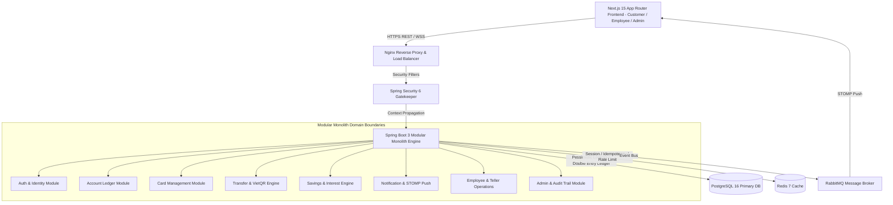

# Nền Tảng Ngân Hàng Số Enterprise (Digital Banking Platform) - Tài Liệu Thiết Kế Kiến Trúc & Yêu Cầu Nghiệp Vụ Master

> **Phiên bản tài liệu**: 2.0.0 (Việt hóa & Đồng bộ Mã Nguồn)  
> **Trạng thái**: Production Ready Architectural Blueprint  
> **Công nghệ mục tiêu**: Java 21 LTS, Spring Boot 3.3+, Spring Security 6, PostgreSQL 16, Redis 7, RabbitMQ, STOMP WebSockets, Next.js 15 (App Router), React 19, TypeScript, Tailwind CSS, TanStack Query v5.

---

## 📚 Mục Lục & Danh Mục Các Chương Chi Tiết

Tài liệu thiết kế Master này được phân tách thành các tài liệu chuyên sâu theo từng Domain nằm trong thư mục [`docs/`](./docs):

### Phần I: Yêu Cầu Nghiệp Vụ & Trải Nghiệm Người Dùng (BRD)
- **[Chương 1: Tóm Tắt Tổng Quan (Executive Summary)](./docs/01-brd-business-requirements.md#1-executive-summary)**
- **[Chương 2: Tổng Quan Dự Án & Phạm Vi Hệ Thống](./docs/01-brd-business-requirements.md#2-project-overview)**
- **[Chương 3: Mục Tiêu Kinh Doanh & Chỉ Số KPI](./docs/01-brd-business-requirements.md#3-business-objectives)**
- **[Chương 4: Yêu Cầu Chức Năng Chi Tiết (Functional Requirements - FR)](./docs/01-brd-business-requirements.md#4-functional-requirements)**
- **[Chương 5: Yêu Cầu Phi Chức Năng (Non-Functional Requirements - NFR)](./docs/01-brd-business-requirements.md#5-non-functional-requirements)**
- **[Chương 6: Phân Quyền Người Dùng (RBAC & User Roles)](./docs/01-brd-business-requirements.md#6-user-roles--access-control)**
- **[Chương 7: Quy Tắc Nghiệp Vụ Tài Chính (Business Rules)](./docs/01-brd-business-requirements.md#7-business-rules)**
- **[Chương 8: Luồng Giao Dịch & Biểu Đồ Quy Trình Mermaid](./docs/01-brd-business-requirements.md#8-business-workflows--detailed-flows)**
- **[Chương 9: Sơ Đồ Use Case Hệ Thống (System Use Case Diagram)](./docs/01-brd-business-requirements.md#9-system-use-case-diagram)**

### Phần II: Kiến Trúc Hệ Thống & Thiết Kế Cấu Trúc
- **[Chương 10: Kiến Trúc Tổng Thể & Modular Monolith](./docs/02-architecture-and-design.md#10-system-architecture)**
- **[Chương 14: Cấu Trúc Thư Mục Backend Java Spring Boot](./docs/02-architecture-and-design.md#14-backend-package-structure-feature-based-architecture)**
- **[Chương 15: Cấu Trúc Thư Mục Frontend Next.js 15 App Router](./docs/02-architecture-and-design.md#15-frontend-folder-structure-nextjs-15-app-router)**
- **[Chương 16: Vòng Đời Xử Lý Yêu Cầu Backend (Request Lifecycle)](./docs/02-architecture-and-design.md#16-backend-request-lifecycle-execution)**
- **[Chương 17: Kiến Trúc Frontend & Quản Lý Trạng Thái (TanStack Query)](./docs/02-architecture-and-design.md#17-frontend-architecture--state-strategy)**

### Phần III: Cơ Sở Dữ Liệu & Lưu Trữ
- **[Chương 11: Thiết Kế ERD & Mô Tả Các Thực Thể Entity](./docs/03-database-design.md#11-database-design)**
- **[Chương 12: Quy Chuẩn Đặt Tên DB & Flyway Migration Scripts](./docs/03-database-design.md#12-database-naming-conventions)**

### Phần IV: Đặc Tả REST API & Dữ Liệu
- **[Chương 13: Chi Tiết REST API Endpoints & Chuẩn Lỗi RFC 7807](./docs/04-api-specification.md#13-rest-api-specification)**

### Phần V: Bảo Mật, Đồng Thời & Giao Dịch
- **[Chương 18: Kiến Trúc Xác Thực (JWT, HttpOnly Cookie & Smart OTP)](./docs/05-security-and-transactions.md#18-authentication-architecture)**
- **[Chương 19: Ma Trận Phân Quyền Chi Tiết (RBAC Matrix)](./docs/05-security-and-transactions.md#19-role-based-access-control-rbac-matrix)**
- **[Chương 20: Thiết Kế Bảo Mật & Chống OWASP Top 10](./docs/05-security-and-transactions.md#20-security-design--owasp-best-practices)**
- **[Chương 21: Quản Lý Giao Dịch, Khóa pessimistic/optimistic & Idempotency](./docs/05-security-and-transactions.md#21-transaction-management--concurrency-control)**
- **[Chương 27: Chiến Lược Xử Lý Ngoại Lệ Toàn Cục (Global Exception)](./docs/05-security-and-transactions.md#27-global-exception-handling-rfc-7807)**
- **[Chương 28: Quy Chuẩn Validation Dữ Liệu Frontend & Backend](./docs/05-security-and-transactions.md)**

### Phần VI: Hạ Tầng Phân Tán, Messaging & Schedulers
- **[Chương 22: Chiến Lược Caching Redis & Khóa Tương Tự Distributed Lock](./docs/06-infrastructure-and-devops.md#22-redis-caching--state-strategy)**
- **[Chương 23: Kiến Trúc Event-Driven Bất Đồng Bộ Với RabbitMQ](./docs/06-infrastructure-and-devops.md#23-rabbitmq-asynchronous-messaging-architecture)**
- **[Chương 24: Real-time Notification Engine Với WebSocket STOMP](./docs/06-infrastructure-and-devops.md#24-websocket-real-time-stomp-engine)**
- **[Chương 25: Lịch Trình Chạy Ngầm (Cron Jobs & Schedulers)](./docs/06-infrastructure-and-devops.md#25-background-schedulers)**
- **[Chương 26: Chiến Lược Ghi Log & Trích Xuất Audit Trail](./docs/06-infrastructure-and-devops.md)**
- **[Chương 29: Cấu Hình Docker Multi-Stage Build](./docs/06-infrastructure-and-devops.md)**
- **[Chương 30: Hệ Sinh Thái Container Với Docker Compose](./docs/06-infrastructure-and-devops.md#30-docker-compose-setup-docker-composeyml)**
- **[Chương 31: Biến Môi Trường Configuration Variables](./docs/06-infrastructure-and-devops.md)**
- **[Chương 33: Tự Động Hóa CI/CD Với GitHub Actions](./docs/06-infrastructure-and-devops.md#33-github-actions-cicd-pipeline)**

### Phần VII: Kiểm Thử, Lộ Trình & Quy Chuẩn Phát Triển
- **[Chương 32: Chiến Lược Kiểm Thử (Testing & Testcontainers)](./docs/07-roadmap-and-standards.md#32-testing-strategy--testcontainers-integration)**
- **[Chương 34: Lộ Trình Triển Khai 12 Tuần (Implementation Roadmap)](./docs/07-roadmap-and-standards.md#34-12-week-implementation-roadmap)**
- **[Chương 35: Quy Chuẩn Code Clean Code & Git Branch Strategy](./docs/07-roadmap-and-standards.md#35-enterprise-coding-standards--git-branch-strategy)**

---

## 🏛️ Sơ Đồ Kiến Trúc Hệ Thống MASTER

---

## 🗺️ Bản Đồ Triển Khai 24 Màn Hình Hệ Thống

Hệ thống mã nguồn Frontend (`frontend/src/app`) bao gồm 24 màn hình được chia thành 3 phân hệ độc lập:

### 1. Phân hệ Khách hàng (Customer Portal)
- `/login` - Đăng nhập tài khoản
- `/register` - Đăng ký trực tuyến
- `/(dashboard)/dashboard` - Trang chủ tổng quan & số dư
- `/(dashboard)/cards` - **Quản lý Thẻ ngân hàng (Debit/Credit/Virtual, Khóa thẻ, Đổi PIN, Hạn mức)**
- `/(dashboard)/qr-pay` - **Thanh toán VietQR NAPAS 247 & Quét mã QR**
- `/(dashboard)/notifications` - **Trung tâm Thông báo biến động số dư & Cảnh báo bảo mật**
- `/(dashboard)/accounts` - Quản lý tài khoản thanh toán & sao kê
- `/(dashboard)/transfers` - Chuyển tiền nội bộ & liên ngân hàng 24/7
- `/(dashboard)/savings` - Gửi tiết kiệm online & tất toán
- `/(dashboard)/bills` - Thanh toán hóa đơn & nạp tiền điện thoại
- `/(dashboard)/beneficiaries` - Danh bạ người thụ hưởng
- `/(dashboard)/transactions` - Lịch sử giao dịch & Tải sao kê PDF/Excel
- `/(dashboard)/settings` & `/change-password` - Cài đặt cá nhân & Đổi mật khẩu

### 2. Phân hệ Nhân viên Ngân hàng (Teller Portal)
- `/employee/dashboard` - Dashboard giao dịch viên
- `/employee/customers` - Tra cứu hồ sơ khách hàng
- `/employee/accounts` - Mở & Khóa/Mở khóa tài khoản tại quầy
- `/employee/kyc` - Phê duyệt hồ sơ định danh eKYC Level 2
- `/employee/cash-ops` - Giao dịch Nộp / Rút tiền mặt tại quầy
- `/employee/transactions` - Tra cứu & Soát xét giao dịch toàn hệ thống

### 3. Phân hệ Quản trị (Admin Portal)
- `/admin/dashboard` - Dashboard phân tích sức khỏe hệ thống
- `/admin/users` - Quản lý nhân viên nội bộ & phân vai trò
- `/admin/roles` - Quản lý phân quyền RBAC
- `/admin/audit` - Nhật ký hệ thống Audit Logs (Vết thao tác)
- `/admin/system` - Cấu hình tham số & Feature Toggles
