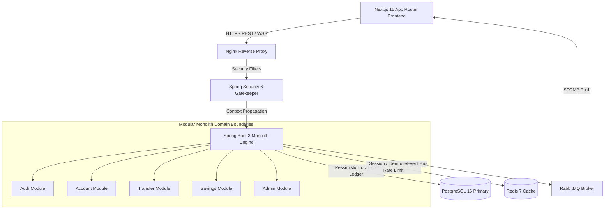
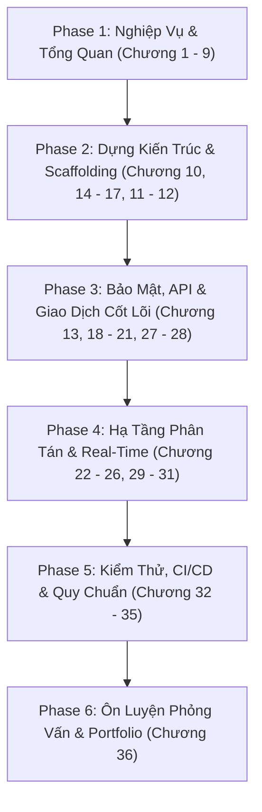

# Enterprise Digital Banking Platform - Master Software Design Document (SDD) & Business Requirement Document (BRD)

> **Document Version**: 1.0.0  
> **Status**: Production Ready Architectural Blueprint  
> **Target Stack**: Java 21, Spring Boot 3.3+, Spring Security 6, PostgreSQL 16, Redis 7, RabbitMQ, STOMP WebSockets, Next.js 15 (App Router), React 19, TypeScript, Tailwind CSS, TanStack Query v5.

---

## Table of Contents & Chapter Directory Index

This Master Specification is partitioned into modular, highly detailed architectural domain documents stored in the [`docs/`](./docs) directory:

### Part I: Business Requirements & User Experience
- **[Chapter 1: Executive Summary](./docs/01-brd-business-requirements.md#1-executive-summary)**
- **[Chapter 2: Project Overview](./docs/01-brd-business-requirements.md#2-project-overview)**
- **[Chapter 3: Business Objectives](./docs/01-brd-business-requirements.md#3-business-objectives)**
- **[Chapter 4: Functional Requirements](./docs/01-brd-business-requirements.md#4-functional-requirements)**
- **[Chapter 5: Non-Functional Requirements](./docs/01-brd-business-requirements.md#5-non-functional-requirements)**
- **[Chapter 6: User Roles & Access Control](./docs/01-brd-business-requirements.md#6-user-roles--access-control)**
- **[Chapter 7: Business Rules](./docs/01-brd-business-requirements.md#7-business-rules)**
- **[Chapter 8: Business Workflows & Mermaid Flowcharts](./docs/01-brd-business-requirements.md#8-business-workflows--detailed-flows)**
- **[Chapter 9: System Use Case Diagram](./docs/01-brd-business-requirements.md#9-system-use-case-diagram)**

### Part II: System Architecture & Structural Design
- **[Chapter 10: System Architecture & Layered Monolith](./docs/02-architecture-and-design.md#10-system-architecture)**
- **[Chapter 14: Backend Package Structure (Feature-Based)](./docs/02-architecture-and-design.md#14-backend-package-structure-feature-based-architecture)**
- **[Chapter 15: Frontend Folder Structure (Next.js 15 App Router)](./docs/02-architecture-and-design.md#15-frontend-folder-structure-nextjs-15-app-router)**
- **[Chapter 16: Backend Request Execution Lifecycle](./docs/02-architecture-and-design.md#16-backend-request-lifecycle-execution)**
- **[Chapter 17: Frontend Architecture & State Management](./docs/02-architecture-and-design.md#17-frontend-architecture--state-strategy)**

### Part III: Data Persistence & Database Design
- **[Chapter 11: Database ERD & Entity Specifications](./docs/03-database-design.md#11-database-design)**
- **[Chapter 12: Database Naming Conventions & Flyway Migrations](./docs/03-database-design.md#12-database-naming-conventions)**

### Part IV: REST API Specifications
- **[Chapter 13: Full REST API Specification & RFC 7807 Errors](./docs/04-api-specification.md#13-rest-api-specification)**

### Part V: Security, Concurrency & Transactions
- **[Chapter 18: Authentication Flow (JWT, Cookie & OTP)](./docs/05-security-and-transactions.md#18-authentication-architecture)**
- **[Chapter 19: Role-Based Access Control (RBAC Matrix)](./docs/05-security-and-transactions.md#19-role-based-access-control-rbac-matrix)**
- **[Chapter 20: Security Design & OWASP Top 10 Mitigation](./docs/05-security-and-transactions.md#20-security-design--owasp-best-practices)**
- **[Chapter 21: Transaction Management, Locking & Idempotency](./docs/05-security-and-transactions.md#21-transaction-management--concurrency-control)**
- **[Chapter 27: Global Exception Handling Strategy](./docs/05-security-and-transactions.md#27-global-exception-handling-rfc-7807)**
- **[Chapter 28: Bean & Frontend Validation Strategy](./docs/05-security-and-transactions.md)**

### Part VI: Distributed Infrastructure, Messaging & Schedulers
- **[Chapter 22: Redis Caching & Key Strategy](./docs/06-infrastructure-and-devops.md#22-redis-caching--state-strategy)**
- **[Chapter 23: RabbitMQ Event-Driven Messaging](./docs/06-infrastructure-and-devops.md#23-rabbitmq-asynchronous-messaging-architecture)**
- **[Chapter 24: WebSocket STOMP Engine](./docs/06-infrastructure-and-devops.md#24-websocket-real-time-stomp-engine)**
- **[Chapter 25: Background Schedulers & Cron Jobs](./docs/06-infrastructure-and-devops.md#25-background-schedulers)**
- **[Chapter 26: Logging & Audit Strategy](./docs/06-infrastructure-and-devops.md)**
- **[Chapter 29: Dockerfile Multi-Stage Build Configurations](./docs/06-infrastructure-and-devops.md)**
- **[Chapter 30: Docker Compose Container Ecosystem](./docs/06-infrastructure-and-devops.md#30-docker-compose-setup-docker-composeyml)**
- **[Chapter 31: Environment Variable Configurations](./docs/06-infrastructure-and-devops.md)**
- **[Chapter 33: GitHub Actions CI/CD Pipeline Automation](./docs/06-infrastructure-and-devops.md#33-github-actions-cicd-pipeline)**

### Part VII: Quality Assurance, Development Roadmap & Standards
- **[Chapter 32: Testing Strategy & Testcontainers Integration](./docs/07-roadmap-and-standards.md#32-testing-strategy--testcontainers-integration)**
- **[Chapter 34: 12-Week Implementation Roadmap](./docs/07-roadmap-and-standards.md#34-12-week-implementation-roadmap)**
- **[Chapter 35: Enterprise Coding Standards & Git Branch Strategy](./docs/07-roadmap-and-standards.md#35-enterprise-coding-standards--git-branch-strategy)**

### Part VIII: Interview Preparation Blueprint
- **[Chapter 36: 100 Enterprise Java Backend & Banking Architecture Interview Questions & Answers](./docs/08-100-interview-questions.md)**

---

## Core System Architectural Snapshot

---

## 🗺️ Path to Mastery: Sequential Chapter-by-Chapter Execution Guide (Chương 1 ➡️ Chương 36)

To build this project successfully, follow this step-by-step linear roadmap from **Chapter 1 through Chapter 36**. Each phase combines learning the architectural theory with hands-on coding execution.

---

### 📌 PHASE 1: Thấu Hiểu Nghiệp Vụ & Quy Trình Ngân Hàng (Chương 1 ➡️ Chương 9)
> **Mục tiêu**: Đọc và nắm vững toàn bộ yêu cầu bài toán trước khi gõ bất kỳ dòng code nào.

1. **[Chương 1: Executive Summary](./docs/01-brd-business-requirements.md#1-executive-summary)**: Hiểu định hướng dự án, công nghệ (Java 21, Spring Boot 3, Next.js 15) và mục tiêu Portfolio.
2. **[Chương 2: Project Overview](./docs/01-brd-business-requirements.md#2-project-overview)**: Nắm mô hình sơ đồ khối giữa Frontend Next.js 15 và Core Monolith Backend.
3. **[Chương 3: Business Objectives](./docs/01-brd-business-requirements.md#3-business-objectives)**: Ghi nhớ các chỉ số cam kết (Latency $< 200\text{ms}$, Uptime $99.95\%$, ACID $100\%$).
4. **[Chương 4: Functional Requirements](./docs/01-brd-business-requirements.md#4-functional-requirements)**: Xem danh sách 14 tính năng cần xây dựng từ Auth, KYC, Chuyển tiền đến Admin.
5. **[Chương 5: Non-Functional Requirements](./docs/01-brd-business-requirements.md#5-non-functional-requirements)**: Nắm các tiêu chuẩn bảo mật OWASP, BCrypt, Rate Limiting.
6. **[Chương 6: User Roles](./docs/01-brd-business-requirements.md#6-user-roles--access-control)**: Hiểu phân quyền 3 nhóm người dùng (`ROLE_CUSTOMER`, `ROLE_EMPLOYEE`, `ROLE_ADMIN`).
7. **[Chương 7: Business Rules](./docs/01-brd-business-requirements.md#7-business-rules)**: Thuộc lòng quy tắc tài khoản (Hạn mức 10k/ngày, OTP khi giao dịch $> \$1,000$, STK 10 chữ số).
8. **[Chương 8: Business Workflows](./docs/01-brd-business-requirements.md#8-business-workflows--detailed-flows)**: Phân tích kỹ Mermaid Flowchart luồng chuyển tiền nội bộ và xử lý OTP.
9. **[Chương 9: System Use Case Diagram](./docs/01-brd-business-requirements.md#9-system-use-case-diagram)**: Đọc sơ đồ Use Case tổng quan hệ thống.

---

### 📌 PHASE 2: Dựng Kiến Trúc & Cấu Trúc Dự Án (Chương 10 ➡️ Chương 17)
> **Mục tiêu**: Tạo khung dự án (Scaffolding), cấu trúc thư mục và khởi tạo CSDL.

10. **[Chương 10: System Architecture](./docs/02-architecture-and-design.md#10-system-architecture)**: Nắm kiến trúc Modular Monolith và nguyên tắc phân chia domain package.
11. **[Chương 11: Database Design](./docs/03-database-design.md#11-database-design)**: Đọc sơ đồ ERD Mermaid, nắm thiết kế bảng `tbl_user`, `tbl_account`, `tbl_transaction`.
12. **[Chương 12: Database Naming Conventions & Flyway](./docs/03-database-design.md#12-database-naming-conventions)**: Tạo file Flyway script `V1__init_schema.sql` đầu tiên trong Spring Boot.
13. **[Chương 14: Backend Package Structure](./docs/02-architecture-and-design.md#14-backend-package-structure-feature-based-architecture)**: Tạo bộ khung thư mục Spring Boot theo **Package-by-Feature** (`module/auth`, `module/account`, `module/transfer`).
14. **[Chương 15: Frontend Folder Structure](./docs/02-architecture-and-design.md#15-frontend-folder-structure-nextjs-15-app-router)**: Tạo dự án Next.js 15 App Router (`src/app/`, `src/features/`, `src/components/`).
15. **[Chương 16: Backend Architecture Lifecycle](./docs/02-architecture-and-design.md#16-backend-request-lifecycle-execution)**: Thiết lập luồng `Controller → Service → Repository → DB → DTO` với MapStruct.
16. **[Chương 17: Frontend Architecture & State Strategy](./docs/02-architecture-and-design.md#17-frontend-architecture--state-strategy)**: Cấu hình Axios Instance, TanStack Query v5 và Refresh Token Interceptor.

---

### 📌 PHASE 3: Lập Trình API, Bảo Mật & Giao Dịch Core (Chương 13, 18 ➡️ 21, 27 ➡️ 28)
> **Mục tiêu**: Code các chức năng cốt lõi (Đăng nhập, JWT, Chuyển tiền an toàn, Lock CSDL).

17. **[Chương 13: REST API Specification](./docs/04-api-specification.md#13-rest-api-specification)**: Lập trình API theo đúng chuẩn REST JSON Response Envelope và HTTP Headers.
18. **[Chương 18: Authentication Architecture](./docs/05-security-and-transactions.md#18-authentication-architecture)**: Code Spring Security 6 filter chain, JWT Token + HttpOnly Cookie + Email OTP.
19. **[Chương 19: Role-Based Access Control (RBAC)](./docs/05-security-and-transactions.md#19-role-based-access-control-rbac-matrix)**: Phân quyền `@PreAuthorize` cho các vai trò `CUSTOMER`, `EMPLOYEE`, `ADMIN`.
20. **[Chương 20: Security Design & OWASP](./docs/05-security-and-transactions.md#20-security-design--owasp-best-practices)**: Cấu hình mã hóa BCrypt, CORS, Anti-CSRF, Rate Limiting.
21. **[Chương 21: Transaction Management & Locking](./docs/05-security-and-transactions.md#21-transaction-management--concurrency-control)**: Implement logic chuyển tiền với `@Transactional`, Pessimistic Lock (`SELECT FOR UPDATE`) và `Idempotency-Key` chống trùng giao dịch.
22. **[Chương 27: Global Exception Handling](./docs/05-security-and-transactions.md#27-global-exception-handling-rfc-7807)**: Viết `@RestControllerAdvice` trả về lỗi chuẩn RFC 7807 Problem Details.
23. **[Chương 28: Validation Strategy](./docs/05-security-and-transactions.md)**: Áp dụng Bean Validation `@Valid` ở Backend và Zod ở Frontend.

---

### 📌 PHASE 4: Hạ Tầng Phân Tán, Real-Time & Container (Chương 22 ➡️ 26, 29 ➡️ 31)
> **Mục tiêu**: Tối ưu hiệu năng với Cache, Message Queue, Push Notification real-time & Docker.

24. **[Chương 22: Redis Caching Strategy](./docs/06-infrastructure-and-devops.md#22-redis-caching--state-strategy)**: Tích hợp Redis cho Session, OTP TTL và Cache số dư tài khoản.
25. **[Chương 23: RabbitMQ Messaging](./docs/06-infrastructure-and-devops.md#23-rabbitmq-asynchronous-messaging-architecture)**: Tích hợp RabbitMQ để gửi email receipt và ghi audit log bất đồng bộ.
26. **[Chương 24: WebSocket STOMP Engine](./docs/06-infrastructure-and-devops.md#24-websocket-real-time-stomp-engine)**: Lập trình push notification biến động số dư real-time qua WebSocket.
27. **[Chương 25: Background Schedulers](./docs/06-infrastructure-and-devops.md#25-background-schedulers)**: Viết Cron Job `@Scheduled` tự động tính lãi tiết kiệm hàng đêm.
28. **[Chương 26: Logging & Audit Strategy](./docs/06-infrastructure-and-devops.md)**: Cấu hình Logback JSON structured log kèm MDC Trace ID.
29. **[Chương 29: Docker Multi-Stage Build](./docs/06-infrastructure-and-devops.md)**: Viết `Dockerfile` tối ưu dung lượng cho Java 21 & Next.js 15.
30. **[Chương 30: Docker Compose Container Ecosystem](./docs/06-infrastructure-and-devops.md#30-docker-compose-setup-docker-composeyml)**: Khởi chạy toàn bộ hạ tầng (Postgres, Redis, RabbitMQ, Backend) chỉ bằng 1 lệnh `docker-compose up -d`.
31. **[Chương 31: Environment Variable Configurations](./docs/06-infrastructure-and-devops.md)**: Quản lý biến môi trường an toàn qua file `.env`.

---

### 📌 PHASE 5: Kiểm Thử, CI/CD & Quy Chuẩn Mã Nguồn (Chương 32 ➡️ Chương 35)
> **Mục tiêu**: Đảm bảo chất lượng mã nguồn, tự động hóa build/test và sẵn sàng đóng gói.

32. **[Chương 32: Testing Strategy & Testcontainers](./docs/07-roadmap-and-standards.md#32-testing-strategy--testcontainers-integration)**: Viết Unit Test JUnit 5 và Integration Test với Testcontainers (PostgreSQL container thật).
33. **[Chương 33: GitHub Actions CI/CD Pipeline](./docs/06-infrastructure-and-devops.md#33-github-actions-cicd-pipeline)**: Thiết lập pipeline tự động chạy test và build Docker Image mỗi khi push code.
34. **[Chương 34: 12-Week Implementation Roadmap](./docs/07-roadmap-and-standards.md#34-12-week-implementation-roadmap)**: Đối soát tiến độ dự án theo milestone 12 tuần.
35. **[Chương 35: Enterprise Coding Standards & Git Strategy](./docs/07-roadmap-and-standards.md#35-enterprise-coding-standards--git-branch-strategy)**: Chuẩn hóa code convention, Java 21 `record`, Conventional Commits và luồng GitFlow.

---

### 📌 PHASE 6: Ôn Luyện Phỏng Vấn & Hoàn Thiện Portfolio (Chương 36)
> **Mục tiêu**: Đưa dự án lên GitHub và tự tin chinh phục nhà tuyển dụng Banking/FinTech.

36. **[Chương 36: 100 Enterprise Java Backend Interview Questions](./docs/08-100-interview-questions.md)**: Ôn tập 100 câu hỏi phỏng vấn thực chiến chuyên sâu. Tự tin trả lời mọi câu hỏi về Concurrency, Pessimistic Locking, Spring Security, Redis và Banking Domain.

---

## Verification & Execution Guide for Developers

1. **Clone & Environment Setup**: Ensure Docker Desktop is running. Execute `docker-compose up -d postgres redis rabbitmq` from the root directory.
2. **Backend Execution**: Run `mvn clean spring-boot:run` inside the backend root. Flyway will automatically execute `V1__init_schema.sql` migrations against PostgreSQL.
3. **Frontend Execution**: Run `npm install && npm run dev` inside the frontend directory. Access application at `http://localhost:3000`.
4. **API Testing & Documentation**: Access dynamic Swagger UI at `http://localhost:8080/swagger-ui.html`.
